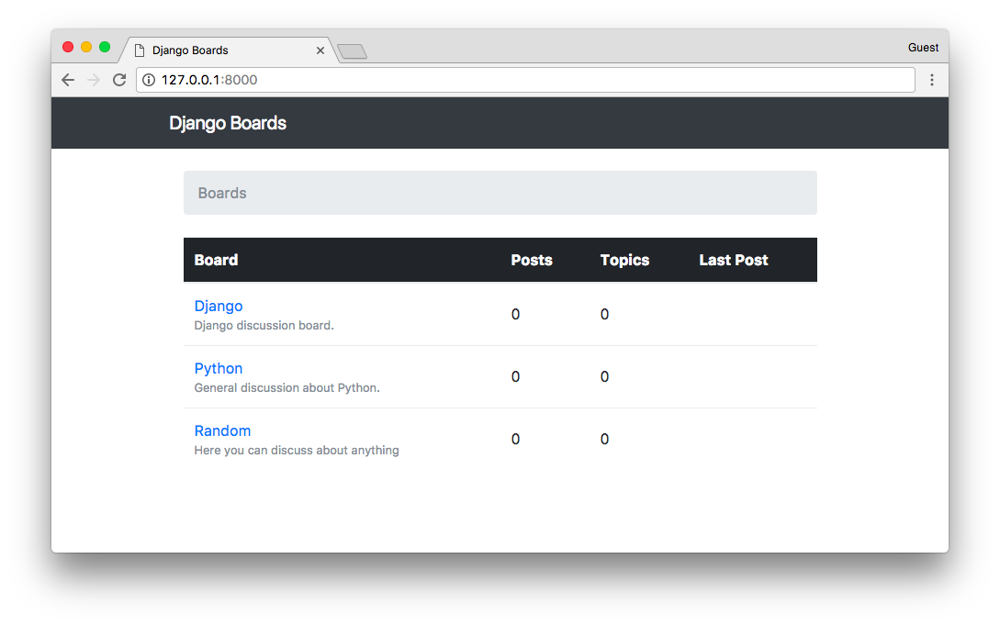
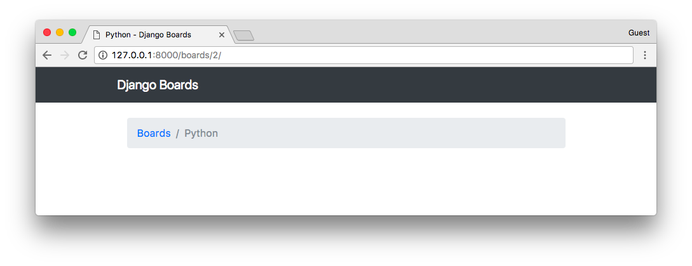
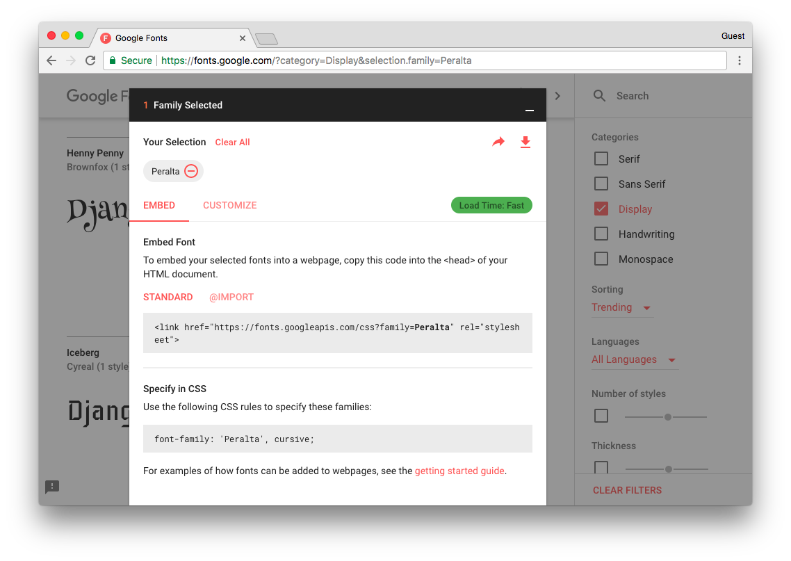
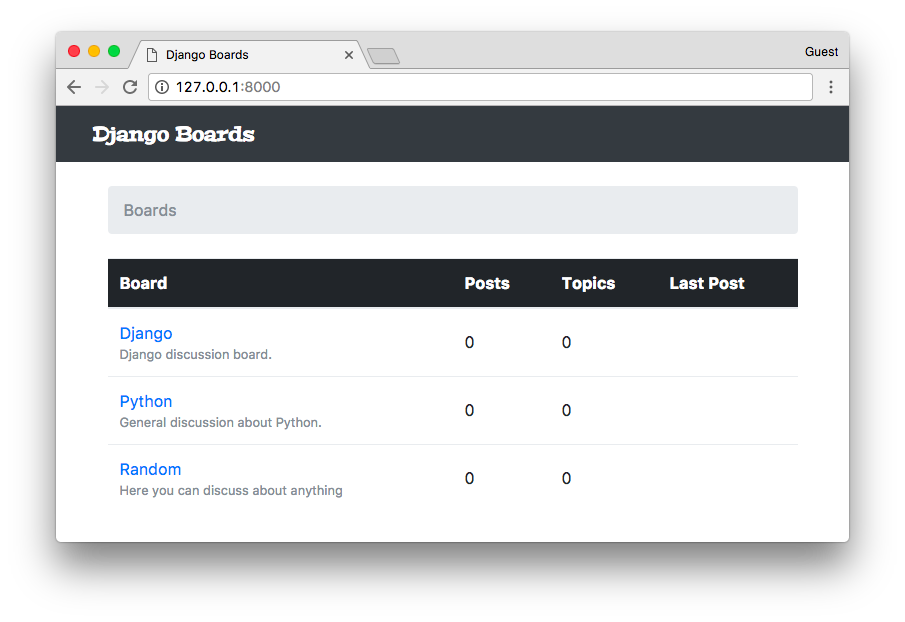

# Django入门与实践-第11章：复用模板

到目前为止，我们一直在复制和粘贴 HTML 文档的多个部分。从长远来看是不可行的。这也是一个坏的做法。

在这一节我们将重写 HTML 模板，创建一个 **master page(母版页)**，其他模板添加它所独特的部分。

在 **templates** 文件夹中创建一个名为 **base.html** 的文件：

**templates/base.html**

```html

<!DOCTYPE html>
<html>
  <head>
    <meta charset="utf-8">
    <title>Django Boards</title>
    <link rel="stylesheet" href="">
  </head>
  <body>
    <div class="container">
      <ol class="breadcrumb my-4">
        
        
      </ol>
      
      
    </div>
  </body>
</html>

```


这是我们的母版页。每个我们创建的模板都 **extend(继承)** 这个特殊的模板。现在我们介绍 `` 标签。它用于在模板中保留一个空间，一个"子"模板(继承这个母版页的模板)可以在这个空间中插入代码和 HTML。

在 `` 中我们还设置了一个默认值 "Django Boards."。如果我们在子模板中未设置 `` 的值它就会被使用。

现在让我们重写我们的两个模板： **home.html** 和 **topics.html**。

**templates/home.html**

```html




  <li class="breadcrumb-item active">Boards</li>



  <table class="table">
    <thead class="thead-inverse">
      <tr>
        <th>Board</th>
        <th>Posts</th>
        <th>Topics</th>
        <th>Last Post</th>
      </tr>
    </thead>
    <tbody>
      
        <tr>
          <td>
            <a href="">{{ board.name }}</a>
            <small class="text-muted d-block">{{ board.description }}</small>
          </td>
          <td class="align-middle">0</td>
          <td class="align-middle">0</td>
          <td></td>
        </tr>
      
    </tbody>
  </table>

```

**home.html** 的第一行是 ``。这个标签用来告诉 Django 使用 **base.html** 作为母版页。之后，我们使用 *blocks* 来放置这个页面独有的部分。

**templates/topics.html**

```html




  {{ board.name }} - {{ block.super }}



  <li class="breadcrumb-item"><a href="">Boards</a></li>
  <li class="breadcrumb-item active">{{ board.name }}</li>



    <!-- just leaving it empty for now. we will add core here soon. -->

```

在 **topics.html** 中，我们改变了 `` 的默认值。注意我们可以通过调用 `{{ block.super }}` 来重用 block 的默认值。这里我们使用的网页标题是 **base.html** 中定义的 "Django Boards"。所以对于 "Python" 的 board 页面，这个标题是 "Python - Django Boards",对于 "Random" board 标题会是 "Random - Django Boards"。

现在我们运行测试，然后会看到我们没有破坏任何东西：

```shell
python manage.py test
```

```shell
Creating test database for alias 'default'...
System check identified no issues (0 silenced).
.......
----------------------------------------------------------------------
Ran 7 tests in 0.067s

OK
Destroying test database for alias 'default'...
```

棒极了！一切看起来都很成功。

现在我们有了 **bast.html** 模板，我们可以很轻松地在顶部添加一个菜单块：

**templates/base.html**

```html

<!DOCTYPE html>
<html>
  <head>
    <meta charset="utf-8">
    <title>Django Boards</title>
    <link rel="stylesheet" href="">
  </head>
  <body>

    <nav class="navbar navbar-expand-lg navbar-dark bg-dark">
      <div class="container">
        <a class="navbar-brand" href="">Django Boards</a>
      </div>
    </nav>

    <div class="container">
      <ol class="breadcrumb my-4">
        
        
      </ol>
      
      
    </div>
  </body>
</html>

```



  


我使用的 HTML 是 [Bootstrap 4 Navbar 组件](https://getbootstrap.com/docs/4.0/components/navbar/) 的一部分。

我喜欢的一个比较好的改动是改变页面的 "logo"(`.navbar-brand`)。

前往 [fonts.google.com](https://fonts.google.com/)，输入 "Django Boards" 或者任何你项目给定的名字然后点击 **apply to all fonts(应用于所有字体)**。浏览一下，找到一个你喜欢的字体。



在 **bast.html** 模板中添加这个字体：

```python
<!DOCTYPE html>
<html>
  <head>
    <meta charset="utf-8">
    <title>Django Boards</title>
    <link href="https://fonts.googleapis.com/css?family=Peralta" rel="stylesheet">
    <link rel="stylesheet" href="">
    <link rel="stylesheet" href="">
  </head>
  <body>
    <!-- code suppressed for brevity -->
  </body>
</html>

```


现在在 **static/css** 文件夹中创建一个新的 CSS 文件命名为 **app.css**：

**static/css/app.css**

```css
.navbar-brand {
  font-family: 'Peralta', cursive;
}
```


