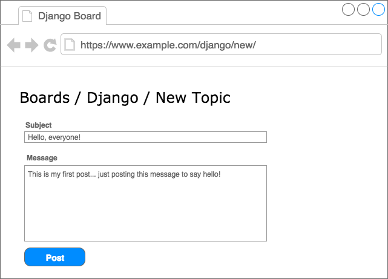
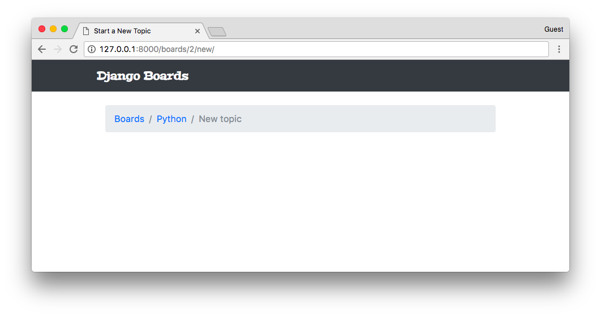
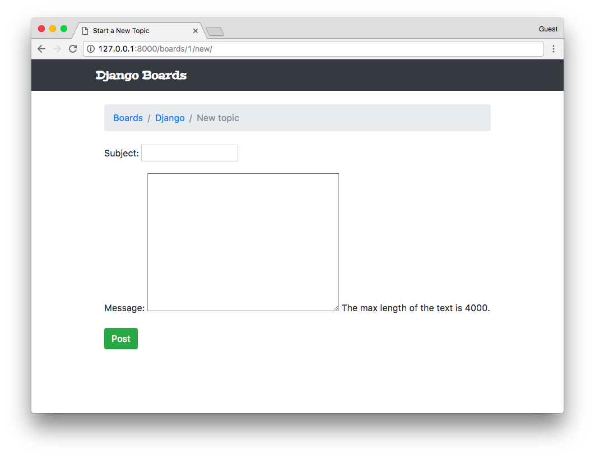
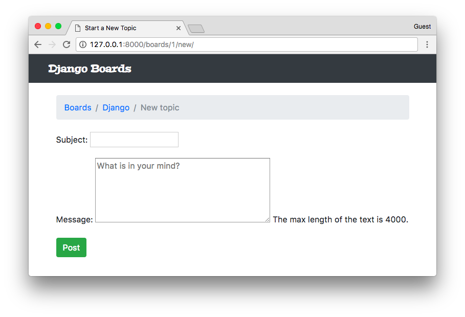
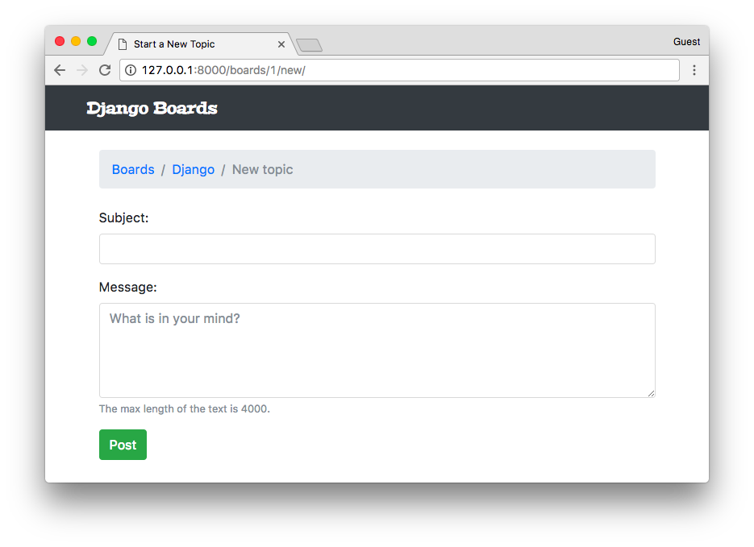
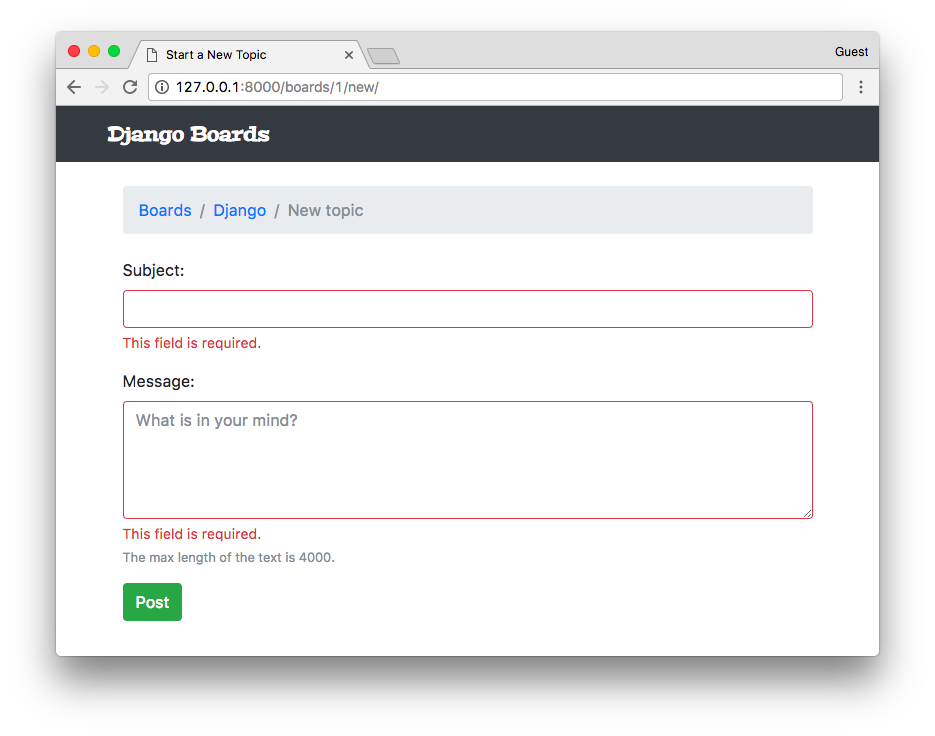
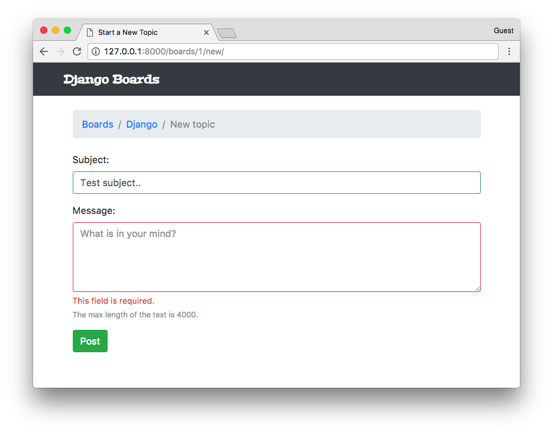

Django入门与实践-第12章：表单处理

Forms(表单) 用来处理我们的输入。这在任何 web 应用或者网站中都是很常见的任务。标准的做法是通过 HTML 表单实现，用户输入一些数据，将其提交给服务器，然后服务器处理它。


表单处理是一项非常复杂的任务，因为它涉及到与应用多个层面的交互。有很多需要关心的问题。例如，提交给服务器的所有数据都是字符串的形式，所以在我们使用它之前需要将其转换为需要的数据类型(整形，浮点型，日期等)。我们必须验证有关应用程序业务逻辑的数据。我们还需要妥善地清理和审查数据，以避免一些诸如 SQL 注入和 XSS 攻击等安全问题。

好消息是，Django Forms API 使整个过程变的更加简单，从而实现了大量工作的自动化。而且，最终的结果比大多数程序员自己去实现的代码更加安全。所以，不管 HTML 的表单多么简单，总是使用Form API。


### 自己实现表单


起初，我想直接跳到表单 API。但是我觉得花点时间去了解一下表单处理的基本细节是一个不错的主意。否则，这玩意儿将会看起来像魔术一样，这是一件坏事，因为当出现错误时，你将不知道怎么去找到问题所在。

随着对一些编程概念的深入理解，我们可以感觉到自己能更好地掌控一些情况。掌控是很重要的，因为它让我们写代码的时候更有信心。一旦我们能确切地知道发生了什么，实现可预见行为的代码就容易多了。调试和查找错误也变得很容易，因为你知道去哪里查找。

无论如何，让我们开始实现下面的表单：



这是我们在前一个教程绘制的线框图。我现在意识到这个可能是一个不好的例子，因为这个特殊的表单涉及到处理两个不同模型数据：**Topic**(subject) 和 **Post**(message)。

还有一点很重要的我们到现在为止还没讨论过，就是用户认证。我们应该只为登录认证过的用户去显示这个页面。通过这种方式，我们才能知道是谁创建了 **Topic** 或者 **Post**。

现在让我们抽象一些细节，重点了解一下怎么在数据库中保存用户的输入。

首先，先创建一个新的 URL 路由，命名为 **new_topic**：

**myproject/urls.py**

```python
from django.conf.urls import url
from django.contrib import admin

from boards import views

urlpatterns = [
    url(r'^$', views.home, name='home'),
    url(r'^boards/(?P<pk>\d+)/$', views.board_topics, name='board_topics'),
    url(r'^boards/(?P<pk>\d+)/new/$', views.new_topic, name='new_topic'),
    url(r'^admin/', admin.site.urls),
]
```

我们创建的这个 URL 能帮我们标识正确的 **Board**

现在来创建 **new_topic** 的 视图函数：

**boards/views.py**

```python
from django.shortcuts import render, get_object_or_404
from .models import Board

def new_topic(request, pk):
    board = get_object_or_404(Board, pk=pk)
    return render(request, 'new_topic.html', {'board': board})
```

目前为止， **new_topic** 的视图函数看起来和 **board_topics** 恰好相同。这是故意的，让我们一步步地来。

现在我们需要一个名为 **new_topic.html** 的模板：

**templates/new_topic.html**

```html



Start a New Topic


  <li class="breadcrumb-item"><a href="">Boards</a></li>
  <li class="breadcrumb-item"><a href="">{{ board.name }}</a></li>
  <li class="breadcrumb-item active">New topic</li>





```

现在我们只有 breadcrumb 导航。注意我们包含了返回到 **board_topics** 视图 URL。

打开 URL **http://127.0.0.1:8000/boards/1/new/**。显示结果是下面这个页面：

!(3-17.png)[./statics/3-17.png]

我们依然还没有实现到达这个新页面的方法，但是如果我们将 URL 改为 **http://127.0.0.1:8000/boards/2/new/**，它会把我们带到 **Python Board** 的页面：



>注意：如果你没有跟着上一节课程一步步地做，你的结果和我的可能有些不一样。在我这个例子中，我的数据库有 3 个 **Board** 实例，分别是 Django = 1, Python = 2, 和 Random = 3。这些数字是数据库中的 ID，用来找到正确的资源。
`

我们可以增加一些测试了：

**boards/tests.py**

```python
from django.core.urlresolvers import reverse
from django.urls import resolve
from django.test import TestCase
from .views import home, board_topics, new_topic
from .models import Board

class HomeTests(TestCase):
    # ...

class BoardTopicsTests(TestCase):
    # ...

class NewTopicTests(TestCase):
    def setUp(self):
        Board.objects.create(name='Django', description='Django board.')

    def test_new_topic_view_success_status_code(self):
        url = reverse('new_topic', kwargs={'pk': 1})
        response = self.client.get(url)
        self.assertEquals(response.status_code, 200)

    def test_new_topic_view_not_found_status_code(self):
        url = reverse('new_topic', kwargs={'pk': 99})
        response = self.client.get(url)
        self.assertEquals(response.status_code, 404)

    def test_new_topic_url_resolves_new_topic_view(self):
        view = resolve('/boards/1/new/')
        self.assertEquals(view.func, new_topic)

    def test_new_topic_view_contains_link_back_to_board_topics_view(self):
        new_topic_url = reverse('new_topic', kwargs={'pk': 1})
        board_topics_url = reverse('board_topics', kwargs={'pk': 1})
        response = self.client.get(new_topic_url)
        self.assertContains(response, 'href="{0}"'.format(board_topics_url))
```

关于我们的测试中新的 NewTopicTests 类的快速总结：

 - **setUp**：创建一个测试中使用的 **Board** 实例
 - **test_new_topic_view_success_status_cod**：检查发给 view 的请求是否成功
 - **test_new_topic_view_not_found_status_code**：检查当 **Board** 不存在时 view 是否会抛出一个 404 的错误
 - **test_new_topic_url_resolves_new_topic_view**：检查是否正在使用正确的 view
 - **test_new_topic_view_contains_link_back_to_board_topics_view**：确保导航能回到 topics 的列表

运行测试：

```shell
python manage.py test
```

```shell
Creating test database for alias 'default'...
System check identified no issues (0 silenced).
...........
----------------------------------------------------------------------
Ran 11 tests in 0.076s

OK
Destroying test database for alias 'default'...
```

成功，现在我们可以去开始创建表单了。

**templates/new_topic.html**

```html



Start a New Topic


  <li class="breadcrumb-item"><a href="">Boards</a></li>
  <li class="breadcrumb-item"><a href="">{{ board.name }}</a></li>
  <li class="breadcrumb-item active">New topic</li>



  <form method="post">
    
    <div class="form-group">
      <label for="id_subject">Subject</label>
      <input type="text" class="form-control" id="id_subject" name="subject">
    </div>
    <div class="form-group">
      <label for="id_message">Message</label>
      <textarea class="form-control" id="id_message" name="message" rows="5"></textarea>
    </div>
    <button type="submit" class="btn btn-success">Post</button>
  </form>

```

这是一个使用 Bootstrap 4 提供的 CSS 类手动创建的 HTML 表单。它看起来是这个样子：

![3-19.png][./statics/3-19.png]

在 `<form>` 标签中，我们定义了 `method` 属性。它会告诉浏览器我们想如何与服务器通信。HTTP 规范定义了几种 request methods(请求方法)。但是在大部分情况下，我们只需要使用 **GET** 和 **POST** 两种 request(请求)类型。

**GET** 可能是最常见的请求类型了。它用于从服务器请求数据。每当你点击了一个链接或者直接在浏览器中输入了一个网址时，你就创建一个 **GET** 请求。

**POST** 用于当我们想更改服务器上的数据的时候。一般来说，每次我们发送数据给服务器都会导致资源状态的变化，我们应该使用 **POST** 请求发送数据。

Django 使用 **CSRF Token**(Cross-Site Request Forgery Token) 保护所有的 **POST** 请求。这是一个避免外部站点或者应用程序向我们的应用程序提交数据的安全措施。应用程序每次接收一个 **POST** 时，都会先检查 **CSRF Token**。如果这个 request 没有 token，或者这个 token是无效的，它就会抛弃提交的数据。

**csrf_token** 的模板标签：

```html


```

它是与其他表单数据一起提交的隐藏字段：

```html

<input type="hidden" name="csrfmiddlewaretoken" value="jG2o6aWj65YGaqzCpl0TYTg5jn6SctjzRZ9KmluifVx0IVaxlwh97YarZKs54Y32">
```

另外一件事是，我们需要设置 HTML 输入的 **name**，**name** 将被用来在服务器获取数据。

```html

<input type="text" class="form-control" id="id_subject" name="subject">
<textarea class="form-control" id="id_message" name="message" rows="5"></textarea>
```

下面是示范我们如何检索数据：

```python
subject = request.POST['subject']
message = request.POST['message']
```

所以，从 HTML 获取数据并且开始一个新的 topic 视图的简单实现可以这样写：

```python
from django.contrib.auth.models import User
from django.shortcuts import render, redirect, get_object_or_404
from .models import Board, Topic, Post

def new_topic(request, pk):
    board = get_object_or_404(Board, pk=pk)

    if request.method == 'POST':
        subject = request.POST['subject']
        message = request.POST['message']

        user = User.objects.first()  # TODO: 临时使用一个账号作为登录用户

        topic = Topic.objects.create(
            subject=subject,
            board=board,
            starter=user
        )

        post = Post.objects.create(
            message=message,
            topic=topic,
            created_by=user
        )

        return redirect('board_topics', pk=board.pk)  # TODO: redirect to the created topic page

    return render(request, 'new_topic.html', {'board': board})
```

这个视图函数只考虑能接收数据并且保存进数据库的乐观合法的 path，但是还缺少一些部分。我们没有验证数据。用户可以提交空表单或者提交一个大于 255 个字符的 **subject**。

到目前为止我们都在对 **User** 字段进行硬编码，因为我们还没有实现身份验证。有一个简单的方法来识别登录的用户。我们会在下一个课程将这一块。此外，我们还没有实现列出 topic 的所有 posts 的视图，实现了它，我们就可以将用户重定向到列出所有主题的列表页面。


点击 **Post** 按钮提交表单：


看起来成功了。但是我们还没有实现主题的列表页面，所以没有东西可以看。让我们来编辑 **templates/topics.html** 来实现一个合适的列表：

**templates/topics.html**

```html




  {{ board.name }} - {{ block.super }}



  <li class="breadcrumb-item"><a href="">Boards</a></li>
  <li class="breadcrumb-item active">{{ board.name }}</li>



  <table class="table">
    <thead class="thead-inverse">
      <tr>
        <th>Topic</th>
        <th>Starter</th>
        <th>Replies</th>
        <th>Views</th>
        <th>Last Update</th>
      </tr>
    </thead>
    <tbody>
      
        <tr>
          <td>{{ topic.subject }}</td>
          <td>{{ topic.starter.username }}</td>
          <td>0</td>
          <td>0</td>
          <td>{{ topic.last_updated }}</td>
        </tr>
      
    </tbody>
  </table>

```


我们创建的 **Topic** 显示在这上面了。

这里有两个新概念。

我们首次使用 **Board** 模型中的 **topics** 属性。**topics** 属性由 Django 使用反向关系自动创建。在之前的步骤中，我们创建了一个 **Topic** 实例：

```python
def new_topic(request, pk):
    board = get_object_or_404(Board, pk=pk)

    # ...

    topic = Topic.objects.create(
        subject=subject,
        board=board,
        starter=user
    )
```

在 `board=board` 这行，我们设置了 **Topic** 模型中的 board 字段，它是 `ForeignKey(Board)`。因此，我们的 **Board** 实例就知道了与它关联的 **Topic** 实例。

之所以我们使用 `board.topics.all` 而不是 `board.topics`，是因为 `board.topics` 是一个 **Related Manager**,它与 **Model Manager** 很相似，通常在 `board.objects` 可得到。所以，要返回给定 board 的所有 topic 我们必须使用 `board.topics.all()`，要过滤一些数据，我们可以这样用 `board.topics.filter(subject__contains='Hello')`。

另一个需要注意的是，在 Python 代码中，我们必须使用括号：`board.topics.all()`，因为 `all()` 是一个方法。在使用 Django 模板语言写代码的时候，在一个 HTML 模板文件里面，我们不使用括号，就只是 `board.topics.all`。

第二件事是我们在使用 `ForeignKey`：

```html

{{ topic.starter.username }}
```

使用一个点加上属性这种写法，我们几乎可以访问 **User** 模型的所有属性。如果我们想得到用户的 email，我们可以使用 `topic.starter.email`。

我们已经修改了 **topics.html** 模板，让我们创建一个能让我们转到 **new topic** 页面的按钮：

**templates/topics.html**

```html


  <div class="mb-4">
    <a href="" class="btn btn-primary">New topic</a>
  </div>

  <table class="table">
    <!-- code suppressed for brevity -->
  </table>

```


我们可以写一个测试以确保用户可以通过此页面访问到 **New Topic** 页面：

**boards/tests.py**

```python
class BoardTopicsTests(TestCase):
    # ...

    def test_board_topics_view_contains_navigation_links(self):
        board_topics_url = reverse('board_topics', kwargs={'pk': 1})
        homepage_url = reverse('home')
        new_topic_url = reverse('new_topic', kwargs={'pk': 1})

        response = self.client.get(board_topics_url)

        self.assertContains(response, 'href="{0}"'.format(homepage_url))
        self.assertContains(response, 'href="{0}"'.format(new_topic_url))
```

我在这里基本上重命名了 **test_board_topics_view_contains_link_back_to_homepage** 方法并添加了一个额外的 `assertContains`。这个测试现在负责确保我们的 view 包含所需的导航链接。


### 测试表单


在我们使用 Django 的方式编写之前的表单示例之前, 让我们先为表单处理写一些测试：

**boards/tests.py**

```python
''' new imports below '''
from django.contrib.auth.models import User
from .views import new_topic
from .models import Board, Topic, Post

class NewTopicTests(TestCase):
    def setUp(self):
        Board.objects.create(name='Django', description='Django board.')
        User.objects.create_user(username='john', email='john@doe.com', password='123')  # <- included this line here

    # ...

    def test_csrf(self):
        url = reverse('new_topic', kwargs={'pk': 1})
        response = self.client.get(url)
        self.assertContains(response, 'csrfmiddlewaretoken')

    def test_new_topic_valid_post_data(self):
        url = reverse('new_topic', kwargs={'pk': 1})
        data = {
            'subject': 'Test title',
            'message': 'Lorem ipsum dolor sit amet'
        }
        response = self.client.post(url, data)
        self.assertTrue(Topic.objects.exists())
        self.assertTrue(Post.objects.exists())

    def test_new_topic_invalid_post_data(self):
        '''
        Invalid post data should not redirect
        The expected behavior is to show the form again with validation errors
        '''
        url = reverse('new_topic', kwargs={'pk': 1})
        response = self.client.post(url, {})
        self.assertEquals(response.status_code, 200)

    def test_new_topic_invalid_post_data_empty_fields(self):
        '''
        Invalid post data should not redirect
        The expected behavior is to show the form again with validation errors
        '''
        url = reverse('new_topic', kwargs={'pk': 1})
        data = {
            'subject': '',
            'message': ''
        }
        response = self.client.post(url, data)
        self.assertEquals(response.status_code, 200)
        self.assertFalse(Topic.objects.exists())
        self.assertFalse(Post.objects.exists())
```

首先， **test.py** 文件变的越来越大。我们会尽快改进它，将测试分为几个文件。但现在，让我们先保持这个状态。

 - **setUp**：包含 `User.objects.create_user` 以创建用于测试的 **User** 实例。
 - 
 - **test_csrf**：由于 **CSRF Token** 是处理 **Post** 请求的基本部分，我们需要保证我们的 HTML 包含 token。
 - 
 - **test_new_topic_valid_post_data**：发送有效的数据并检查视图函数是否创建了 **Topic** 和 **Post** 实例。
 - 
 - **test_new_topic_invalid_post_data**：发送一个空字典来检查应用的行为。
 - 
 - **test_new_topic_invalid_post_data_empty_fields**：类似于上一个测试，但是这次我们发送一些数据。预期应用程序会验证并且拒绝空的 subject 和 message。

运行这些测试：

```python
python manage.py test
```

```python
Creating test database for alias 'default'...
System check identified no issues (0 silenced).
........EF.....
======================================================================
ERROR: test_new_topic_invalid_post_data (boards.tests.NewTopicTests)
----------------------------------------------------------------------
Traceback (most recent call last):
...
django.utils.datastructures.MultiValueDictKeyError: "'subject'"

======================================================================
FAIL: test_new_topic_invalid_post_data_empty_fields (boards.tests.NewTopicTests)
----------------------------------------------------------------------
Traceback (most recent call last):
  File "/Users/vitorfs/Development/myproject/django-beginners-guide/boards/tests.py", line 115, in test_new_topic_invalid_post_data_empty_fields
    self.assertEquals(response.status_code, 200)
AssertionError: 302 != 200

----------------------------------------------------------------------
Ran 15 tests in 0.512s

FAILED (failures=1, errors=1)
Destroying test database for alias 'default'...
```

有一个失败的测试和一个错误。两个都与验证用户的输入有关。不要试图用当前的实现来修复它，让我们通过使用 Django Forms API 来通过这些测试


### 创建表单正确的姿势

自从我们开始使用 Forms，我们已经走了很长一段路。终于，是时候使用 Forms API 了。

Forms API 可在模块 `django.forms` 中得到。Django 使用两种类型的 form：`forms.Form` 和 `forms.ModelForm`。`Form` 类是通用的表单实现。我们可以使用它来处理与应用程序 model 没有直接关联的数据。`ModelForm` 是 `Form` 的子类，它与 model 类相关联。
 
在 **boards** 文件夹下创建一个新的文件 `forms.py`：

**boards/forms.py**

```python
from django import forms
from .models import Topic

class NewTopicForm(forms.ModelForm):
    message = forms.CharField(widget=forms.Textarea(), max_length=4000)

    class Meta:
        model = Topic
        fields = ['subject', 'message']
```

这是我们的第一个 form。它是一个与 **Topic** model 相关联的 `ModelForm `。**Meta** 类里面 `fields` 列表中的 `subject` 引用 **Topic** 类中的 **subject** field(字段)。现在注意到我们定义了一个叫做 `message` 的额外字段。它用来引用 **Post** 中我们想要保存的 message。

现在我们需要重写我们的 **views.py**：

**boards/views.py**

```python
from django.contrib.auth.models import User
from django.shortcuts import render, redirect, get_object_or_404
from .forms import NewTopicForm
from .models import Board, Topic, Post

def new_topic(request, pk):
    board = get_object_or_404(Board, pk=pk)
    user = User.objects.first()  # TODO: get the currently logged in user
    if request.method == 'POST':
        form = NewTopicForm(request.POST)
        if form.is_valid():
            topic = form.save(commit=False)
            topic.board = board
            topic.starter = user
            topic.save()
            post = Post.objects.create(
                message=form.cleaned_data.get('message'),
                topic=topic,
                created_by=user
            )
            return redirect('board_topics', pk=board.pk)  # TODO: redirect to the created topic page
    else:
        form = NewTopicForm()
    return render(request, 'new_topic.html', {'board': board, 'form': form})
```

这是我们在 view(视图) 中处理 form(表单) 的方式。让我们去掉一些多余的部分，只看表单处理的核心部分：

```python
if request.method == 'POST':
    form = NewTopicForm(request.POST)
    if form.is_valid():
        topic = form.save()
        return redirect('board_topics', pk=board.pk)
else:
    form = NewTopicForm()
return render(request, 'new_topic.html', {'form': form})
```

首先我们判断请求是 **POST** 还是 **GET**。如果请求是 **POST**，这意味着用户向服务器提交了一些数据。所以我们实例化一个将 **POST** 数据传递给 form 的 form 实例：`form = NewTopicForm(request.POST)`。

然后，我们让 Django 验证数据，检查 form 是否有效，我们能否将其存入数据库：`if form.is_valid():`。如果表单有效，我们使用 `form.save()` 将数据存入数据库。`save()` 方法返回一个存入数据库的 Model 实例。
所以，因为这是一个 **Topic** form, 所以它会返回 `topic = form.save()` 创建的 **Topic**。然后，通用的路径是把用户重定向到其他地方，以避免用户通过按 F5 重新提交表单，并且保证应用程序的流程走向。

现在，如果数据是无效的，Django 会给 form 添加错误列表。然后，视图函数不会做任何处理并且返回最后一句：
`return render(request, 'new_topic.html', {'form': form})`。这意味着我们需要更新 **new_topic.html** 以显示错误。

如果请求是 **GET**，我们只需要使用 `form = NewTopicForm()` 初始化一个新的空表单。

让我们运行测试并观察情况：

```python
python manage.py test
```

```python
Creating test database for alias 'default'...
System check identified no issues (0 silenced).
...............
----------------------------------------------------------------------
Ran 15 tests in 0.522s

OK
Destroying test database for alias 'default'...
```

我们甚至修复了最后两个测试。

Django Forms API 不仅仅是处理和验证数据。它还为我们生成 HTML。

**templates/new_topic.html**

```html



Start a New Topic


  <li class="breadcrumb-item"><a href="">Boards</a></li>
  <li class="breadcrumb-item"><a href="">{{ board.name }}</a></li>
  <li class="breadcrumb-item active">New topic</li>



  <form method="post">
    
    {{ form.as_p }}
    <button type="submit" class="btn btn-success">Post</button>
  </form>

```

这个 `form` 有三个渲染选项：`form.as_table`，`form.as_ul` 和 `form.as_p`。这是一个快速的渲染表单所有字段的方法。顾名思义，`as_table` 使用 table 标签来格式化输入，`as_ul` 使用 li 标签。

看看效果：


我们以前的 form 看起来更好，是吧？我们将立即修复它。

它看起来很破，但是相信我；它背后有很多东西。它非常强大。比如，如果我们的表单有 50 个字段，我们可以通过键入 `{{ form.as_p }}` 来显示所有字段。

此外，使用 Forms API，Django 会验证数据并且向每个字段添加错误消息。让我们尝试提交一个空的表单：


>注意：
如果你提交表单时看到类似这样的东西：，这不是 Django 导致的，而是你的浏览器进行预验证。要禁用它可以在你的表单标签中添加 **novalidate** 属性：**<form method="post" novalidate>**

>你可以不修改它，不会有问题。这只是因为我们的表单现在非常简单，而且我们没有太多的数据验证可以看到。

>另外一件需要注意的事情是：没有 “只客户端验证” 这样的事情。JavaScript 验证或者浏览器验证仅用于可用性目的。同时也减少了对服务器的请求数量。数据验证应该始终在服务器端完成，这样我们可以完全掌控数据。
`

它还可以处理在 **Form** 类或者 **Model** 类中定义的帮助文本。

**boards/forms.py**

```python
from django import forms
from .models import Topic

class NewTopicForm(forms.ModelForm):
    message = forms.CharField(
        widget=forms.Textarea(),
        max_length=4000,
        help_text='The max length of the text is 4000.'
    )

    class Meta:
        model = Topic
        fields = ['subject', 'message']
```


  
我们也可以为表单字段设置额外的属性：

**boards/forms.py**

```python
from django import forms
from .models import Topic

class NewTopicForm(forms.ModelForm):
    message = forms.CharField(
        widget=forms.Textarea(
            attrs={'rows': 5, 'placeholder': 'What is on your mind?'}
        ),
        max_length=4000,
        help_text='The max length of the text is 4000.'
    )

    class Meta:
        model = Topic
        fields = ['subject', 'message']
```




###  用BootStrap 表单渲染


现在让我们把事情做得更完善。

当使用 Bootstrap 或者其他的前端库时，我比较喜欢使用一个叫做 **django-widget-tweaks** 的 Django 库。它可以让我们更好地控制渲染的处理，在保证默认值的情况下，只需在上面添加额外的自定义设置。

开始安装它：

```python
pip install django-widget-tweaks
```

添加到 `INSTALLED_APPS`：

**myproject/settings.py**

```python
INSTALLED_APPS = [
    'django.contrib.admin',
    'django.contrib.auth',
    'django.contrib.contenttypes',
    'django.contrib.sessions',
    'django.contrib.messages',
    'django.contrib.staticfiles',

    'widget_tweaks',

    'boards',
]
```

现在可以使用它了：

**templates/new_topic.html**

```python




Start a New Topic


  <li class="breadcrumb-item"><a href="">Boards</a></li>
  <li class="breadcrumb-item"><a href="">{{ board.name }}</a></li>
  <li class="breadcrumb-item active">New topic</li>



  <form method="post" novalidate>
    

    
      <div class="form-group">
        {{ field.label_tag }}

        

        
          <small class="form-text text-muted">
            {{ field.help_text }}
          </small>
        
      </div>
    

    <button type="submit" class="btn btn-success">Post</button>
  </form>

```



这就是我们使用的 **django-widget-tweaks** 的效果。首先，我们使用 **** 模板标签将其加载到模板。然后这样使用它：

```html


```

`render_field` 不属于 Django；它存在于我们安装的包里面。要使用它，我们需要传递一个表单域实例作为第一个参数，然后我们可以添加任意的 HTML 属性去补充它。这很有用因为我们可以根据特定的条件指定类。

一些 `render_field` 模板标签的例子：

```html





```

现在要实现 Bootstrap 4 验证标签，我们可以修改 **new_topic.html** 模板。

**templates/new_topic.html**

```html

<form method="post" novalidate>
  

  
    <div class="form-group">
      {{ field.label_tag }}

      
        

          
          
            <div class="invalid-feedback">
              {{ error }}
            </div>
          

        
          
        
      
        
      

      
        <small class="form-text text-muted">
          {{ field.help_text }}
        </small>
      
    </div>
  

  <button type="submit" class="btn btn-success">Post</button>
</form>
```

效果是：





所以，我们有三种不同的渲染状态：

 - **Initial state**：表单没有数据(不受约束)
 - **Invalid**：我们添加了 `.is-invalid` 这个 CSS class 并将错误消息添加到具有 `.invalid-feedback` class 的元素中
 - **Valid**：我们添加了 `.is-valid` 的 CSS class，以绿色绘制表单域，并向用户反馈它是否可行。


###  复用表单模板

模板看起来有点复杂，是吧？有个好消息是我们可以在项目中重复使用它。

在 **templates** 文件夹中，创建一个新的文件夹命名为 **includes**：

```shell
myproject/
 |-- myproject/
 |    |-- boards/
 |    |-- myproject/
 |    |-- templates/
 |    |    |-- includes/    <-- here!
 |    |    |-- base.html
 |    |    |-- home.html
 |    |    |-- new_topic.html
 |    |    +-- topics.html
 |    +-- manage.py
 +-- venv/
```
 
在 **includes** 文件夹中，创建一个 **form.html**：

**templates/includes/form.html**

```html




  <div class="form-group">
    {{ field.label_tag }}

    
      
        
        
          <div class="invalid-feedback">
            {{ error }}
          </div>
        
      
        
      
    
      
    

    
      <small class="form-text text-muted">
        {{ field.help_text }}
      </small>
    
  </div>

```

现在来修改我们的 **new_topic.html** 模板：

**templates/new_topic.html**

```html



Start a New Topic


  <li class="breadcrumb-item"><a href="">Boards</a></li>
  <li class="breadcrumb-item"><a href="">{{ board.name }}</a></li>
  <li class="breadcrumb-item active">New topic</li>



  <form method="post" novalidate>
    
    
    <button type="submit" class="btn btn-success">Post</button>
  </form>

```

顾名思义，`` 用来在其他的模板中包含 HTML 模板。这是在项目中重用 HTML 组件的常用方法。

在下一个我们实现的表单，我们可以简单地使用 `` 去渲染它。

**Adding More Tests**

现在我们在使用 **Django 表单**；我们可以添加更多的测试以确保它能运行顺利

**boards/tests.py**

```python
# ... other imports
from .forms import NewTopicForm

class NewTopicTests(TestCase):
    # ... other tests

    def test_contains_form(self):  # <- new test
        url = reverse('new_topic', kwargs={'pk': 1})
        response = self.client.get(url)
        form = response.context.get('form')
        self.assertIsInstance(form, NewTopicForm)

    def test_new_topic_invalid_post_data(self):  # <- updated this one
        '''
        Invalid post data should not redirect
        The expected behavior is to show the form again with validation errors
        '''
        url = reverse('new_topic', kwargs={'pk': 1})
        response = self.client.post(url, {})
        form = response.context.get('form')
        self.assertEquals(response.status_code, 200)
        self.assertTrue(form.errors)
```

这是我们第一次使用 `assertIsInstance` 方法。基本上我们的处理是抓取上下文的表单实例，检查它是否是一个 `NewTopicForm`。在最后的测试中，我添加了 `self.assertTrue(form.errors)` 以确保数据无效的时候表单会显示错误。


###  总结

在这个课程，我们学习了 URLs, 可重用模板和表单。像往常一样，我们也实现了几个测试用例。这能使我们开发中更自信。

我们的测试文件变的越来越大，所以在下一节中，我们重构它以提高它的可维护性，从而维持我们代码的增加。

我们也达到了我们需要与登录的用户进行交互的目的。在下一节，我们学习了关于认证的一切知识和怎么去保护我们的视图和资源。

该项目的源代码在 GitHub 可用。项目的当前状态可以在发布标签 **v0.3-lw** 下找到。下面是链接：

[https://github.com/sibtc/django-beginners-guide/tree/v0.3-lw](https://github.com/sibtc/django-beginners-guide/tree/v0.3-lw)

 


  [1]: https://simpleisbetterthancomplex.com/media/series/beginners-guide/1.11/part-3/wireframe-topics.png
 