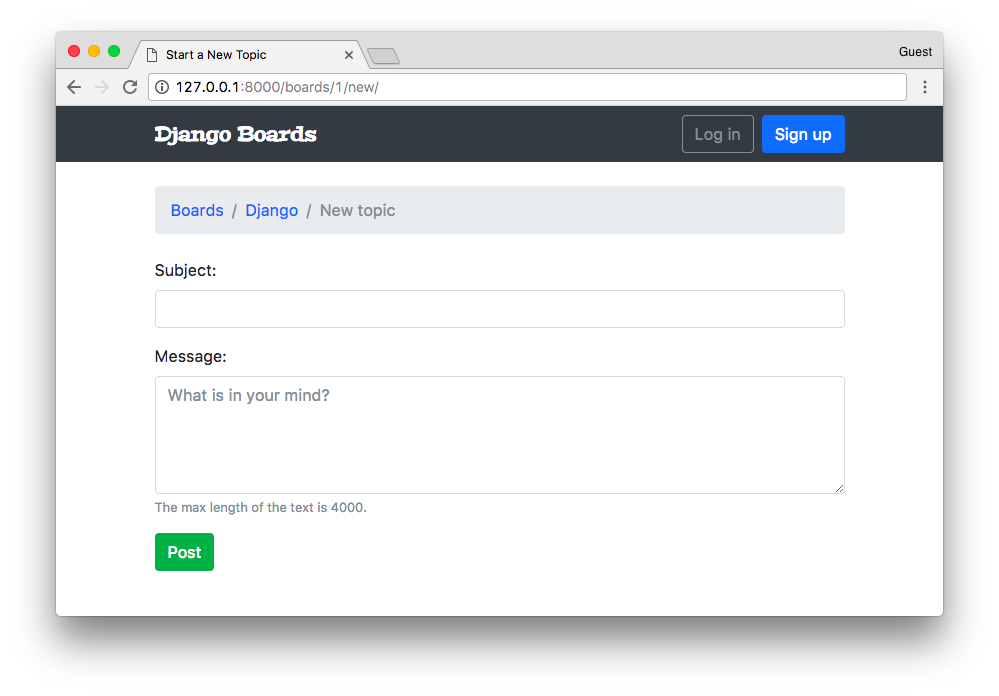
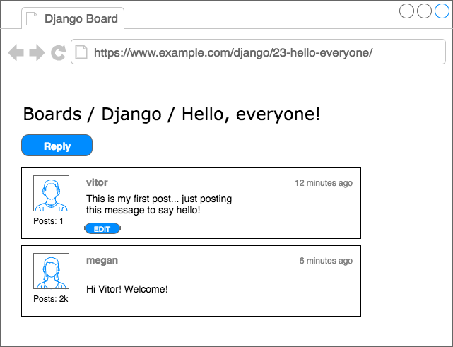
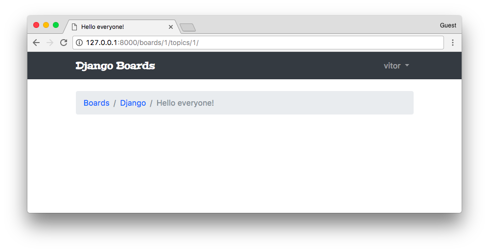

# 一个完整的Django入门指南 - 第5部分

> 译者：刘志军  
> 原文：https://simpleisbetterthancomplex.com/series/2017/10/02/a-complete-beginners-guide-to-django-part-5.html


## 前言

欢迎来到本系列教程的第5部分，在这节课，我们将学习关于如何保护视图防止未登录的用户访问，以及在视图和表单中访问已经经过身份验证的用户。我们还将实现主题列表和回复视图，最后，我们将探索 Django ORM 的一些特性和数据迁移的简单介绍。


## 保护视图

我们必须保护视图防止那些未认证（登录）的用户访问，下面是发起一个新话题的页面



在上图中，用户还没有登录，尽管他们可以看到页面和表单。

Django 有一个内置的 *视图装饰器* 来避免这个问题：

**boards/views.py**（[完整代码](https://gist.github.com/vitorfs/4d3334a0daa9e7a872653a22ff39320a#file-models-py-L19)）

```python
from django.contrib.auth.decorators import login_required

@login_required
def new_topic(request, pk):
    # ...
```

现在如果用户没有登录，将被重定向到登录页面：


注意查询字符串 **?next=/boards/1/new/** ，我们可以改进登录模板以便利用 **next** 变量来改进我们的用户体验

### 配置登录Next重定向

**templates/login.html** ([查看完整内容](https://gist.github.com/vitorfs/1ab597fe18e2dc56028f7aa8c3b588b3#file-login-html-L13))

```python
<form method="post" novalidate>
  
  <input type="hidden" name="next" value="{{ next }}">
  
  <button type="submit" class="btn btn-primary btn-block">Log in</button>
</form>
```
（译注：实际上这步操作不加也没问题）

然后，如果我们现在尝试登录，登录成功后，应用程序会跳转到到原来所在的位置。


**next** 参数是内置功能的一部分（译注：详情请参考Django[官方文档](https://docs.djangoproject.com/en/2.0/topics/auth/default/#the-login-required-decorator)）

## 测试 Login Required

现在添加一个测试用例确保该视图被 `@login_required`装饰器保护的，不过，我们先来重构一下 **boards/tests/test_views.py** 文件。

把**test_views.py**拆分成3个文件：


* **test_view_home.py** 包含 HomeTests 类 （[完整代码](https://gist.github.com/vitorfs/6ac3aad244c856d418f18890efcb4a7e#file-test_view_home-py)）
* **test_view_board_topics.py** 包含 BoardTopicsTests 类（[完整代码](https://gist.github.com/vitorfs/6ac3aad244c856d418f18890efcb4a7e#file-test_view_board_topics-py)）
* **test_view_new_topic.py** 包含 NewTopicTests 类（[完整代码](https://gist.github.com/vitorfs/6ac3aad244c856d418f18890efcb4a7e#file-test_view_new_topic-py)）


```shell
myproject/
 |-- myproject/
 |    |-- accounts/
 |    |-- boards/
 |    |    |-- migrations/
 |    |    |-- templatetags/
 |    |    |-- tests/
 |    |    |    |-- __init__.py
 |    |    |    |-- test_templatetags.py
 |    |    |    |-- test_view_home.py          <-- here
 |    |    |    |-- test_view_board_topics.py  <-- here
 |    |    |    +-- test_view_new_topic.py     <-- and here
 |    |    |-- __init__.py
 |    |    |-- admin.py
 |    |    |-- apps.py
 |    |    |-- models.py
 |    |    +-- views.py
 |    |-- myproject/
 |    |-- static/
 |    |-- templates/
 |    |-- db.sqlite3
 |    +-- manage.py
 +-- venv/
 ```

 重新运行测试，确保一切正常。

 现在在**test_view_new_topic.py**中添加一个新的测试用例，用来检查试图是否被`@login_required`保护：

 **boards/tests/test_view_new_topic.py** （[完成代码](https://gist.github.com/itorfs/13e75451396d76354b476edaefadbdab#file-test_view_new_topic-py-L84)）


 ```python
 from django.test import TestCase
from django.urls import reverse
from ..models import Board

class LoginRequiredNewTopicTests(TestCase):
    def setUp(self):
        Board.objects.create(name='Django', description='Django board.')
        self.url = reverse('new_topic', kwargs={'pk': 1})
        self.response = self.client.get(self.url)

    def test_redirection(self):
        login_url = reverse('login')
        self.assertRedirects(self.response, '{login_url}?next={url}'.format(login_url=login_url, url=self.url))

```


在测试用例中，我们尝试在没有登录的情况下发送请求给 **new topic** 视图，期待的结果是请求重定向到登录页面。


## 访问已登录用户


现在我么可以改进 **new_topic** 视图，设置正确的用户，取代之前直接从数据库查询出来的第一个用户，这份代码是临时的，因为我们那时候还没有方法去获取登录的用户，但是现在可以了：

**boards/views.py** ([完整代码](https://gist.github.com/vitorfs/483936caca4618dc275545ad2dfbef24#file-views-py-L19))

```python
from django.contrib.auth.decorators import login_required
from django.shortcuts import get_object_or_404, redirect, render

from .forms import NewTopicForm
from .models import Board, Post

@login_required
def new_topic(request, pk):
    board = get_object_or_404(Board, pk=pk)
    if request.method == 'POST':
        form = NewTopicForm(request.POST)
        if form.is_valid():
            topic = form.save(commit=False)
            topic.board = board
            topic.starter = request.user  # <- here
            topic.save()
            Post.objects.create(
                message=form.cleaned_data.get('message'),
                topic=topic,
                created_by=request.user  # <- and here
            )
            return redirect('board_topics', pk=board.pk)  # TODO: redirect to the created topic page
    else:
        form = NewTopicForm()
    return render(request, 'new_topic.html', {'board': board, 'form': form})
```

我们可以添加一个新的主题快速验证一下：


## 帖子回复页面

现在我们花点时间来实现主题的回复列表页面，先来看一下下面的原型图：



首先我们需要写URL路由：

**myproject/urls.py**([完成代码](https://gist.github.com/vitorfs/aede6d3b7dc3494cf0df48f796075403#file-urls-py-L38))

```python
url(r'^boards/(?P<pk>\d+)/topics/(?P<topic_pk>\d+)/$', views.topic_posts, name='topic_posts'),
```

有两个关键字参数需要处理，`pk`用于唯一标识版块（Board），`topic_pk`用户唯一标识话题回复来自哪个主题。

**boards/views.py**（[完整代码](https://gist.github.com/vitorfs/3d73ef25a01eceea07ef3ad8538437cf#file-views-py-L39))

```python
from django.shortcuts import get_object_or_404, render
from .models import Topic

def topic_posts(request, pk, topic_pk):
    topic = get_object_or_404(Topic, board__pk=pk, pk=topic_pk)
    return render(request, 'topic_posts.html', {'topic': topic})
```


注意我们正在间接地获取当然的版块，记住，主题（topic）模型关联到版块（Board）模型，所以我们可以访问当前的版块，你将在下一个代码段中看到：

**templates/topic_posts.html**([完整代码](https://gist.github.com/vitorfs/17e583f4f0068850c5929bd307dd436a))

```html


{{ topic.subject }}


  <li class="breadcrumb-item"><a href="">Boards</a></li>
  <li class="breadcrumb-item"><a href="">{{ topic.board.name }}</a></li>
  <li class="breadcrumb-item active">{{ topic.subject }}</li>





```

现在你会看到我们在模板中 `board.name`被替换掉了，在导航条，是使用的topic的属性：`topic.board.name`。



现在我们给**topic_posts**添加一个新的测试文件：

**boards/tests/test_view_topic_posts.py**

```python
from django.contrib.auth.models import User
from django.test import TestCase
from django.urls import resolve, reverse

from ..models import Board, Post, Topic
from ..views import topic_posts


class TopicPostsTests(TestCase):
    def setUp(self):
        board = Board.objects.create(name='Django', description='Django board.')
        user = User.objects.create_user(username='john', email='john@doe.com', password='123')
        topic = Topic.objects.create(subject='Hello, world', board=board, starter=user)
        Post.objects.create(message='Lorem ipsum dolor sit amet', topic=topic, created_by=user)
        url = reverse('topic_posts', kwargs={'pk': board.pk, 'topic_pk': topic.pk})
        self.response = self.client.get(url)

    def test_status_code(self):
        self.assertEquals(self.response.status_code, 200)

    def test_view_function(self):
        view = resolve('/boards/1/topics/1/')
        self.assertEquals(view.func, topic_posts)
```

注意到，setup函数变得越来越复杂，我们可以创建一个 minxin 或者抽象类来重用这些代码，我们也可以使用第三方库来初始化设置一些测试数据，来减少这些样板代码。

同时，我们已经有了大量的测试用例，运行速度开始逐渐变得慢起来，我们可以通过用测试套件的方式通过指定的app。

```shell
python manage.py test boards

```

```shell
Creating test database for alias 'default'...
System check identified no issues (0 silenced).
.......................
----------------------------------------------------------------------
Ran 23 tests in 1.246s

OK
Destroying test database for alias 'default'...
```

我们还可以只运行指定的测试文件

```shell
python manage.py test boards.tests.test_view_topic_posts
```

```shell
Creating test database for alias 'default'...
System check identified no issues (0 silenced).
..
----------------------------------------------------------------------
Ran 2 tests in 0.129s

OK
Destroying test database for alias 'default'...

```

抑或是指定一个测试用例

```shell
python manage.py test boards.tests.test_view_topic_posts.TopicPostsTests.test_status_code

```

```shell
Creating test database for alias 'default'...
System check identified no issues (0 silenced).
.
----------------------------------------------------------------------
Ran 1 test in 0.100s

OK
Destroying test database for alias 'default'...

```
很酷，是不是？

继续前行！

在 topic_posts.html 页面中，我们可以创建一个for循环迭代主题下的回复

**templates/topic_posts.html**

```html




{{ topic.subject }}


  <li class="breadcrumb-item"><a href="">Boards</a></li>
  <li class="breadcrumb-item"><a href="">{{ topic.board.name }}</a></li>
  <li class="breadcrumb-item active">{{ topic.subject }}</li>




  <div class="mb-4">
    <a href="#" class="btn btn-primary" role="button">Reply</a>
  </div>

  
    <div class="card mb-2">
      <div class="card-body p-3">
        <div class="row">
          <div class="col-2">
            
            <small>Posts: {{ post.created_by.posts.count }}</small>
          </div>
          <div class="col-10">
            <div class="row mb-3">
              <div class="col-6">
                <strong class="text-muted">{{ post.created_by.username }}</strong>
              </div>
              <div class="col-6 text-right">
                <small class="text-muted">{{ post.created_at }}</small>
              </div>
            </div>
            {{ post.message }}
            
              <div class="mt-3">
                <a href="#" class="btn btn-primary btn-sm" role="button">Edit</a>
              </div>
            
          </div>
        </div>
      </div>
    </div>
  


```

因为我们现在还没有任何方法去上传用户图片，所以先放一张空的图片，我从[ IconFinder](https://www.iconfinder.com/search/?q=user&license=2&price=free)下载了一张免费图片，然后保存在项目的 static/img 目录。


我们还没有真正探索过Django的ORM，但代码`{{ post.created_by.posts.count }}` 在数据库中执行一个`select count`查询。尽管结果是正确的，但不是一个好的方法。因为它在数据库中造成了多次不必要的查询。但是，嘿，现在不用担心，先专注于如何与应用程序进行交互。稍后，我们将改进此代码，以及如何诊断那些复杂笨重的查询。（译注：过早优化是万恶之源）


