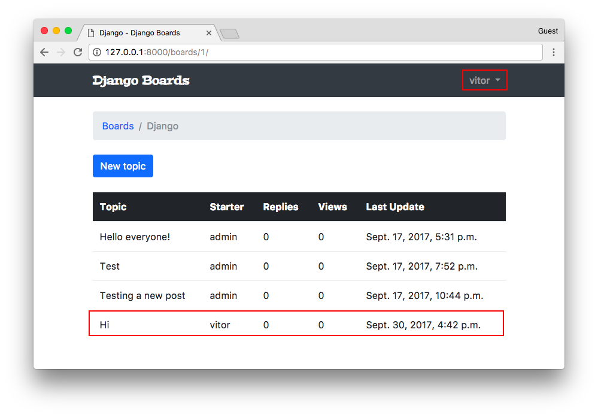
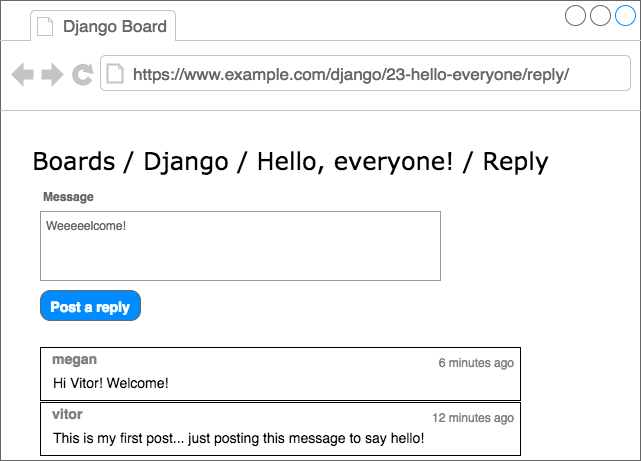
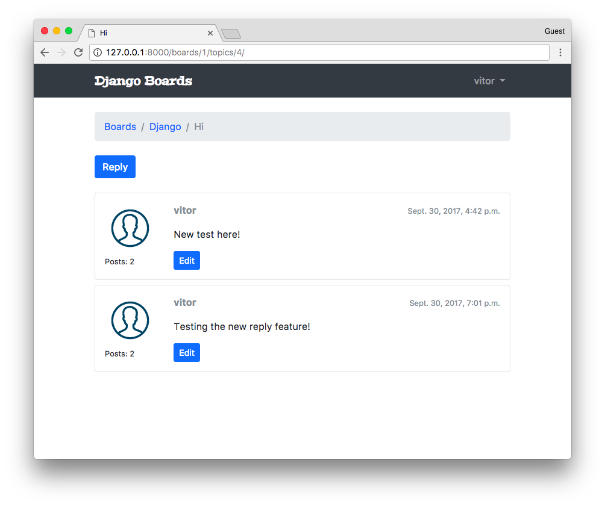
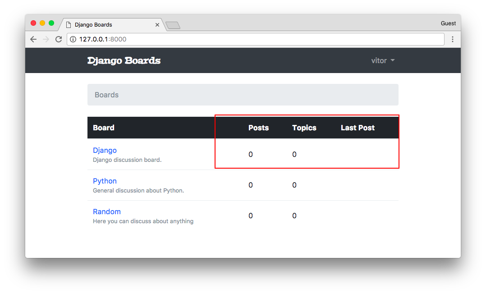
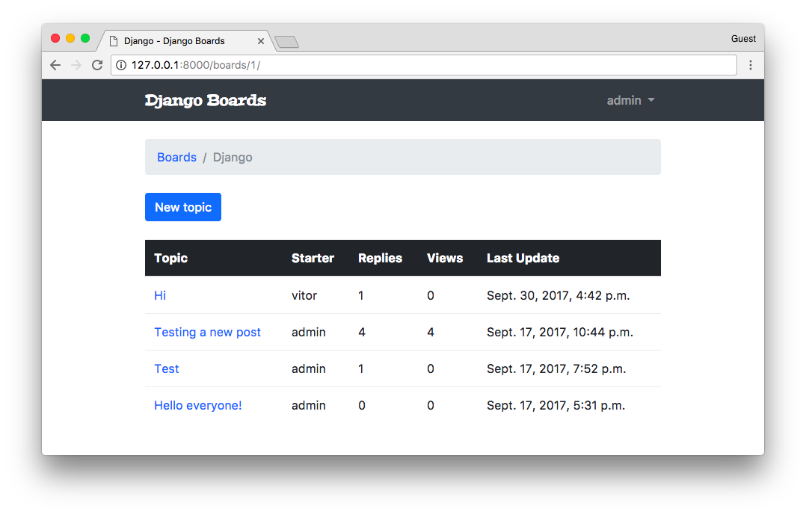

# 一个完整的Django入门指南 - 第5部分

> 译者：刘志军  
> 原文：https://simpleisbetterthancomplex.com/series/2017/10/02/a-complete-beginners-guide-to-django-part-5.html


## 前言

欢迎来到本系列教程的第5部分，在这节课，我们将学习关于如何保护视图防止未登录的用户访问，以及在视图和表单中访问已经经过身份验证的用户。我们还将实现主题列表和回复视图，最后，我们将探索 Django ORM 的一些特性和数据迁移的简单介绍。


## 保护视图

我们必须保护视图防止那些未认证（登录）的用户访问，下面是发起一个新话题的页面


在上图中，用户还没有登录，尽管他们可以看到页面和表单。

Django 有一个内置的 *视图装饰器* 来避免这个问题：

**boards/views.py**（[完整代码](https://gist.github.com/vitorfs/4d3334a0daa9e7a872653a22ff39320a#file-models-py-L19)）

```python
from django.contrib.auth.decorators import login_required

@login_required
def new_topic(request, pk):
    # ...
```

现在如果用户没有登录，将被重定向到登录页面：


注意查询字符串 **?next=/boards/1/new/** ，我们可以改进登录模板以便利用 **next** 变量来改进我们的用户体验

### 配置登录Next重定向

**templates/login.html** ([查看完整内容](https://gist.github.com/vitorfs/1ab597fe18e2dc56028f7aa8c3b588b3#file-login-html-L13))

```python
<form method="post" novalidate>
  
  <input type="hidden" name="next" value="{{ next }}">
  
  <button type="submit" class="btn btn-primary btn-block">Log in</button>
</form>
```
（译注：实际上这步操作不加也没问题）

然后，如果我们现在尝试登录，登录成功后，应用程序会跳转到到原来所在的位置。


**next** 参数是内置功能的一部分（译注：详情请参考Django[官方文档](https://docs.djangoproject.com/en/2.0/topics/auth/default/#the-login-required-decorator)）

## 测试 Login Required

现在添加一个测试用例确保该视图被 `@login_required`装饰器保护的，不过，我们先来重构一下 **boards/tests/test_views.py** 文件。

把**test_views.py**拆分成3个文件：


* **test_view_home.py** 包含 HomeTests 类 （[完整代码](https://gist.github.com/vitorfs/6ac3aad244c856d418f18890efcb4a7e#file-test_view_home-py)）
* **test_view_board_topics.py** 包含 BoardTopicsTests 类（[完整代码](https://gist.github.com/vitorfs/6ac3aad244c856d418f18890efcb4a7e#file-test_view_board_topics-py)）
* **test_view_new_topic.py** 包含 NewTopicTests 类（[完整代码](https://gist.github.com/vitorfs/6ac3aad244c856d418f18890efcb4a7e#file-test_view_new_topic-py)）


```shell
myproject/
 |-- myproject/
 |    |-- accounts/
 |    |-- boards/
 |    |    |-- migrations/
 |    |    |-- templatetags/
 |    |    |-- tests/
 |    |    |    |-- __init__.py
 |    |    |    |-- test_templatetags.py
 |    |    |    |-- test_view_home.py          <-- here
 |    |    |    |-- test_view_board_topics.py  <-- here
 |    |    |    +-- test_view_new_topic.py     <-- and here
 |    |    |-- __init__.py
 |    |    |-- admin.py
 |    |    |-- apps.py
 |    |    |-- models.py
 |    |    +-- views.py
 |    |-- myproject/
 |    |-- static/
 |    |-- templates/
 |    |-- db.sqlite3
 |    +-- manage.py
 +-- venv/
 ```

 重新运行测试，确保一切正常。

 现在在**test_view_new_topic.py**中添加一个新的测试用例，用来检查试图是否被`@login_required`保护：

 **boards/tests/test_view_new_topic.py** （[完成代码](https://gist.github.com/itorfs/13e75451396d76354b476edaefadbdab#file-test_view_new_topic-py-L84)）


 ```python
 from django.test import TestCase
from django.urls import reverse
from ..models import Board

class LoginRequiredNewTopicTests(TestCase):
    def setUp(self):
        Board.objects.create(name='Django', description='Django board.')
        self.url = reverse('new_topic', kwargs={'pk': 1})
        self.response = self.client.get(self.url)

    def test_redirection(self):
        login_url = reverse('login')
        self.assertRedirects(self.response, '{login_url}?next={url}'.format(login_url=login_url, url=self.url))

```


在测试用例中，我们尝试在没有登录的情况下发送请求给 **new topic** 视图，期待的结果是请求重定向到登录页面。


## 访问已登录用户


现在我么可以改进 **new_topic** 视图，设置正确的用户，取代之前直接从数据库查询出来的第一个用户，这份代码是临时的，因为我们那时候还没有方法去获取登录的用户，但是现在可以了：

**boards/views.py** ([完整代码](https://gist.github.com/vitorfs/483936caca4618dc275545ad2dfbef24#file-views-py-L19))

```python
from django.contrib.auth.decorators import login_required
from django.shortcuts import get_object_or_404, redirect, render

from .forms import NewTopicForm
from .models import Board, Post

@login_required
def new_topic(request, pk):
    board = get_object_or_404(Board, pk=pk)
    if request.method == 'POST':
        form = NewTopicForm(request.POST)
        if form.is_valid():
            topic = form.save(commit=False)
            topic.board = board
            topic.starter = request.user  # <- here
            topic.save()
            Post.objects.create(
                message=form.cleaned_data.get('message'),
                topic=topic,
                created_by=request.user  # <- and here
            )
            return redirect('board_topics', pk=board.pk)  # TODO: redirect to the created topic page
    else:
        form = NewTopicForm()
    return render(request, 'new_topic.html', {'board': board, 'form': form})
```

我们可以添加一个新的主题快速验证一下：




## 帖子回复页面

现在我们花点时间来实现主题的回复列表页面，先来看一下下面的原型图：


首先我们需要写URL路由：

**myproject/urls.py**([完成代码](https://gist.github.com/vitorfs/aede6d3b7dc3494cf0df48f796075403#file-urls-py-L38))

```python
url(r'^boards/(?P<pk>\d+)/topics/(?P<topic_pk>\d+)/$', views.topic_posts, name='topic_posts'),
```

有两个关键字参数需要处理，`pk`用于唯一标识版块（Board），`topic_pk`用户唯一标识话题回复来自哪个主题。

**boards/views.py**（[完整代码](https://gist.github.com/vitorfs/3d73ef25a01eceea07ef3ad8538437cf#file-views-py-L39))

```python
from django.shortcuts import get_object_or_404, render
from .models import Topic

def topic_posts(request, pk, topic_pk):
    topic = get_object_or_404(Topic, board__pk=pk, pk=topic_pk)
    return render(request, 'topic_posts.html', {'topic': topic})
```


注意我们正在间接地获取当然的版块，记住，主题（topic）模型关联到版块（Board）模型，所以我们可以访问当前的版块，你将在下一个代码段中看到：

**templates/topic_posts.html**([完整代码](https://gist.github.com/vitorfs/17e583f4f0068850c5929bd307dd436a))

```html


{{ topic.subject }}


  <li class="breadcrumb-item"><a href="">Boards</a></li>
  <li class="breadcrumb-item"><a href="">{{ topic.board.name }}</a></li>
  <li class="breadcrumb-item active">{{ topic.subject }}</li>





```

现在你会看到我们在模板中 `board.name`被替换掉了，在导航条，是使用的topic的属性：`topic.board.name`。


现在我们给**topic_posts**添加一个新的测试文件：

**boards/tests/test_view_topic_posts.py**

```python
from django.contrib.auth.models import User
from django.test import TestCase
from django.urls import resolve, reverse

from ..models import Board, Post, Topic
from ..views import topic_posts


class TopicPostsTests(TestCase):
    def setUp(self):
        board = Board.objects.create(name='Django', description='Django board.')
        user = User.objects.create_user(username='john', email='john@doe.com', password='123')
        topic = Topic.objects.create(subject='Hello, world', board=board, starter=user)
        Post.objects.create(message='Lorem ipsum dolor sit amet', topic=topic, created_by=user)
        url = reverse('topic_posts', kwargs={'pk': board.pk, 'topic_pk': topic.pk})
        self.response = self.client.get(url)

    def test_status_code(self):
        self.assertEquals(self.response.status_code, 200)

    def test_view_function(self):
        view = resolve('/boards/1/topics/1/')
        self.assertEquals(view.func, topic_posts)
```

注意到，setup函数变得越来越复杂，我们可以创建一个 minxin 或者抽象类来重用这些代码，我们也可以使用第三方库来初始化设置一些测试数据，来减少这些样板代码。

同时，我们已经有了大量的测试用例，运行速度开始逐渐变得慢起来，我们可以通过用测试套件的方式通过指定的app。

```shell
python manage.py test boards

```

```shell
Creating test database for alias 'default'...
System check identified no issues (0 silenced).
.......................
----------------------------------------------------------------------
Ran 23 tests in 1.246s

OK
Destroying test database for alias 'default'...
```

我们还可以只运行指定的测试文件

```shell
python manage.py test boards.tests.test_view_topic_posts
```

```shell
Creating test database for alias 'default'...
System check identified no issues (0 silenced).
..
----------------------------------------------------------------------
Ran 2 tests in 0.129s

OK
Destroying test database for alias 'default'...

```

抑或是指定一个测试用例

```shell
python manage.py test boards.tests.test_view_topic_posts.TopicPostsTests.test_status_code

```

```shell
Creating test database for alias 'default'...
System check identified no issues (0 silenced).
.
----------------------------------------------------------------------
Ran 1 test in 0.100s

OK
Destroying test database for alias 'default'...

```
很酷，是不是？

继续前行！

在 topic_posts.html 页面中，我们可以创建一个for循环迭代主题下的回复

**templates/topic_posts.html**

```html




{{ topic.subject }}


  <li class="breadcrumb-item"><a href="">Boards</a></li>
  <li class="breadcrumb-item"><a href="">{{ topic.board.name }}</a></li>
  <li class="breadcrumb-item active">{{ topic.subject }}</li>




  <div class="mb-4">
    <a href="#" class="btn btn-primary" role="button">Reply</a>
  </div>

  
    <div class="card mb-2">
      <div class="card-body p-3">
        <div class="row">
          <div class="col-2">
            
            <small>Posts: {{ post.created_by.posts.count }}</small>
          </div>
          <div class="col-10">
            <div class="row mb-3">
              <div class="col-6">
                <strong class="text-muted">{{ post.created_by.username }}</strong>
              </div>
              <div class="col-6 text-right">
                <small class="text-muted">{{ post.created_at }}</small>
              </div>
            </div>
            {{ post.message }}
            
              <div class="mt-3">
                <a href="#" class="btn btn-primary btn-sm" role="button">Edit</a>
              </div>
            
          </div>
        </div>
      </div>
    </div>
  


```

因为我们现在还没有任何方法去上传用户图片，所以先放一张空的图片，我从[ IconFinder](https://www.iconfinder.com/search/?q=user&license=2&price=free)下载了一张免费图片，然后保存在项目的 static/img 目录。


我们还没有真正探索过Django的ORM，但代码`{{ post.created_by.posts.count }}` 在数据库中会执行一个`select count`查询。尽管结果是正确的，但不是一个好方法。因为它在数据库中造成了多次不必要的查询。不过现在不用担心，先专注于如何与应用程序进行交互。稍后，我们将改进此代码，以及如何诊断那些复杂笨重的查询。（译注：过早优化是万恶之源）


另一个有意思的地方是我们正在测试当前帖子是否属于当前登录用户：``，我们只给帖子的拥有者显示编辑按钮。

因为我们现在要在主题页面添加一个URL路由到主题的帖子列表，更新 topic.html 模版，加上一个链接：

**templates/topics.html** ([完整代码](https://gist.github.com/vitorfs/cb4b7c9ff382ddeafb4114d0c84b3869))

```python

  <tr>
    <td><a href="">{{ topic.subject }}</a></td>
    <td>{{ topic.starter.username }}</td>
    <td>0</td>
    <td>0</td>
    <td>{{ topic.last_updated }}</td>
  </tr>

```

## 回帖视图

现在让我们来实现回复帖子的视图，以便我们可以添加更多的数据和改进功能实现与单元测试。



添加新的URL路由：

**myproject/urls.py**([完整代码](https://gist.github.com/vitorfs/71a5f9f39202edfbab9bacf11844548b#file-urls-py-L39))

```python
url(r'^boards/(?P<pk>\d+)/topics/(?P<topic_pk>\d+)/reply/$', views.reply_topic, name='reply_topic'),

```

给回帖创建一个新的表单：

**boards/forms.py** ([完整代码](https://gist.github.com/vitorfs/3dd5ed2b3e27b4c12886e9426acf8fda#file-forms-py-L20))

```python
from django import forms
from .models import Post

class PostForm(forms.ModelForm):
    class Meta:
        model = Post
        fields = ['message', ]
```

一个新的受`@login_required`保护的视图，以及简单的表单处理逻辑

**boards/views.py**([完整代码](https://gist.github.com/vitorfs/9e3811d9b11958b4106d99d9243efa71#file-views-py-L45))


```python
from django.contrib.auth.decorators import login_required
from django.shortcuts import get_object_or_404, redirect, render
from .forms import PostForm
from .models import Topic

@login_required
def reply_topic(request, pk, topic_pk):
    topic = get_object_or_404(Topic, board__pk=pk, pk=topic_pk)
    if request.method == 'POST':
        form = PostForm(request.POST)
        if form.is_valid():
            post = form.save(commit=False)
            post.topic = topic
            post.created_by = request.user
            post.save()
            return redirect('topic_posts', pk=pk, topic_pk=topic_pk)
    else:
        form = PostForm()
    return render(request, 'reply_topic.html', {'topic': topic, 'form': form})
```

现在我们再会到**new_topic**视图函数，更新重定向地址（标记为 **#TODO** 的地方）

```python
@login_required
def new_topic(request, pk):
    board = get_object_or_404(Board, pk=pk)
    if request.method == 'POST':
        form = NewTopicForm(request.POST)
        if form.is_valid():
            topic = form.save(commit=False)
            # code suppressed ...
            return redirect('topic_posts', pk=pk, topic_pk=topic.pk)  # <- here
    # code suppressed ...
```

值得注意的是：在视图函数**replay_topic**中，我们使用`topic_pk`，因为我们引用的是函数的关键字参数，而在**new_topic**视图中，我们使用的是`topic.pk`，因为`topic`是一个对象（Topic模型的实例对象），`.pk`是这个实例对象的一个属性，这两种细微的差别，其实区别很大，别搞混了。

回复页面模版的一个版本：

**templates/reply_topic.html**

```html




Post a reply


  <li class="breadcrumb-item"><a href="">Boards</a></li>
  <li class="breadcrumb-item"><a href="">{{ topic.board.name }}</a></li>
  <li class="breadcrumb-item"><a href="">{{ topic.subject }}</a></li>
  <li class="breadcrumb-item active">Post a reply</li>




  <form method="post" class="mb-4">
    
    
    <button type="submit" class="btn btn-success">Post a reply</button>
  </form>

  
    <div class="card mb-2">
      <div class="card-body p-3">
        <div class="row mb-3">
          <div class="col-6">
            <strong class="text-muted">{{ post.created_by.username }}</strong>
          </div>
          <div class="col-6 text-right">
            <small class="text-muted">{{ post.created_at }}</small>
          </div>
        </div>
        {{ post.message }}
      </div>
    </div>
  


```


提交回复之后，用户会跳回主题的回复列表：



我们可以改变第一条帖子的样式，使得它在页面上更突出：

**templates/topic_posts.html**([完整代码](https://gist.github.com/vitorfs/3e4ad94ac3ae9d72194af4006d4aeaff#file-topic_posts-html-L20))

```html

  <div class="card mb-2 border-dark">
    
      <div class="card-header text-white bg-dark py-2 px-3">{{ topic.subject }}</div>
    
    <div class="card-body p-3">
      <!-- code suppressed -->
    </div>
  </div>

```


现在对于测试，已经实现标准化流程了，就像我们迄今为止所做的一样。 在boards / tests 木兰中中创建一个新文件 **test_view_reply_topic.py**：

**boards/tests/test_view_reply_topic.py** ([完整代码](https://gist.github.com/vitorfs/7148fcb95075fb6641e638214b751cf1))

```python
from django.contrib.auth.models import User
from django.test import TestCase
from django.urls import reverse
from ..models import Board, Post, Topic
from ..views import reply_topic

class ReplyTopicTestCase(TestCase):
    '''
    Base test case to be used in all `reply_topic` view tests
    '''
    def setUp(self):
        self.board = Board.objects.create(name='Django', description='Django board.')
        self.username = 'john'
        self.password = '123'
        user = User.objects.create_user(username=self.username, email='john@doe.com', password=self.password)
        self.topic = Topic.objects.create(subject='Hello, world', board=self.board, starter=user)
        Post.objects.create(message='Lorem ipsum dolor sit amet', topic=self.topic, created_by=user)
        self.url = reverse('reply_topic', kwargs={'pk': self.board.pk, 'topic_pk': self.topic.pk})

class LoginRequiredReplyTopicTests(ReplyTopicTestCase):
    # ...

class ReplyTopicTests(ReplyTopicTestCase):
    # ...

class SuccessfulReplyTopicTests(ReplyTopicTestCase):
    # ...

class InvalidReplyTopicTests(ReplyTopicTestCase):
    # ...
```

这里的精髓在于自定义了测试用例基类**ReplyTopicTestCase**。然后所有四个类将继承这个测试用例。

首先，我们测试视图是否受`@login_required`装饰器保护，然后检查HTML输入，状态码。最后，我们测试一个有效和无效的表单提交。


## QuerySets（查询结果集）

现在，让我们花点时间来探索一些关于模型的 API。首先，我们来改进主页：



有3个任务：

* 显示每个板块的总主题数
* 显示每个板块的总回复数
* 显示每个板块的最后发布者和日期

在实现这些功能前，我们先使用Python终端

因为我们要在Python终端尝试，把所有的models定义一个 `__str__` 方法是个好主意

**boards/models.py**([完整代码](https://gist.github.com/vitorfs/9524eb42005697fbb79836285b50b1f4))

```python
from django.db import models
from django.utils.text import Truncator

class Board(models.Model):
    # ...
    def __str__(self):
        return self.name

class Topic(models.Model):
    # ...
    def __str__(self):
        return self.subject

class Post(models.Model):
    # ...
    def __str__(self):
        truncated_message = Truncator(self.message)
        return truncated_message.chars(30)
```

在 Post 模型中，使用了 `Truncator` 工具类，这是将一个长字符串截取为任意长度字符的简便方法（这里我们使用30个字符）

现在打开 Python shell 

```shell
python manage.py shell

# First get a board instance from the database
board = Board.objects.get(name='Django')
```

这三个任务中最简单的一个就是获取当前版块的总主题数，因为 Topic 和 Baoard 是直接关联的。

```shell
board.topics.all()
<QuerySet [<Topic: Hello everyone!>, <Topic: Test>, <Topic: Testing a new post>, <Topic: Hi>]>

board.topics.count()
4
```

就这样子。

现在统计一个版块下面的回复数量有点麻烦，因为回复并没有直接和Board关联

```shell
from boards.models import Post

Post.objects.all()
<QuerySet [<Post: This is my first topic.. :-)>, <Post: test.>, <Post: Hi everyone!>,
  <Post: New test here!>, <Post: Testing the new reply feature!>, <Post: Lorem ipsum dolor sit amet,...>,
  <Post: hi there>, <Post: test>, <Post: Testing..>, <Post: some reply>, <Post: Random random.>
]>

Post.objects.count()
11
```

这里一共11个回复，但是它并不全部属于 "Django" 这个版块的。

我们可以这样来过滤

```shell
from boards.models import Board, Post

board = Board.objects.get(name='Django')

Post.objects.filter(topic__board=board)
<QuerySet [<Post: This is my first topic.. :-)>, <Post: test.>, <Post: hi there>,
  <Post: Hi everyone!>, <Post: Lorem ipsum dolor sit amet,...>, <Post: New test here!>,
  <Post: Testing the new reply feature!>
]>

Post.objects.filter(topic__board=board).count()
7
```

双下划线的`topic_board`用于通过模板关系来定位，在内部，Django 在 Board-Topic-Post之间构建了桥梁，构建SQ查询来获取属于指定版块下面的帖子回复。


最后一个任务是标识版块下面的最后一条回复

```shell
# order by the `created_at` field, getting the most recent first
Post.objects.filter(topic__board=board).order_by('-created_at')
<QuerySet [<Post: testing>, <Post: new post>, <Post: hi there>, <Post: Lorem ipsum dolor sit amet,...>,
  <Post: Testing the new reply feature!>, <Post: New test here!>, <Post: Hi everyone!>,
  <Post: test.>, <Post: This is my first topic.. :-)>
]>

# we can use the `first()` method to just grab the result that interest us
Post.objects.filter(topic__board=board).order_by('-created_at').first()
<Post: testing>
```

太棒了，现在我们来实现它

**boards/models.py** ([完整代码](https://gist.github.com/vitorfs/74077336decd75292082752eb8405ad3))

```python
from django.db import models

class Board(models.Model):
    name = models.CharField(max_length=30, unique=True)
    description = models.CharField(max_length=100)

    def __str__(self):
        return self.name

    def get_posts_count(self):
        return Post.objects.filter(topic__board=self).count()

    def get_last_post(self):
        return Post.objects.filter(topic__board=self).order_by('-created_at').first()
```

注意，我们使用的是`self`，因为这是Board的一个实例方法，所以我们就用这个Board实例来过滤这个 QuerySet

现在我们可以改进主页的HTML模板来显示这些新的信息

**templates/home.html**

```html



  <li class="breadcrumb-item active">Boards</li>



  <table class="table">
    <thead class="thead-inverse">
      <tr>
        <th>Board</th>
        <th>Posts</th>
        <th>Topics</th>
        <th>Last Post</th>
      </tr>
    </thead>
    <tbody>
      
        <tr>
          <td>
            <a href="">{{ board.name }}</a>
            <small class="text-muted d-block">{{ board.description }}</small>
          </td>
          <td class="align-middle">
            {{ board.get_posts_count }}
          </td>
          <td class="align-middle">
            {{ board.topics.count }}
          </td>
          <td class="align-middle">
            
              <small>
                <a href="">
                  By {{ post.created_by.username }} at {{ post.created_at }}
                </a>
              </small>
            
          </td>
        </tr>
      
    </tbody>
  </table>

```

现在是这样的效果


运行测试：
```shell
python manage.py test
```

```shell
Creating test database for alias 'default'...
System check identified no issues (0 silenced).
.......................................................EEE......................
======================================================================
ERROR: test_home_url_resolves_home_view (boards.tests.test_view_home.HomeTests)
----------------------------------------------------------------------
django.urls.exceptions.NoReverseMatch: Reverse for 'topic_posts' with arguments '(1, '')' not found. 1 pattern(s) tried: ['boards/(?P<pk>\\d+)/topics/(?P<topic_pk>\\d+)/$']

======================================================================
ERROR: test_home_view_contains_link_to_topics_page (boards.tests.test_view_home.HomeTests)
----------------------------------------------------------------------
django.urls.exceptions.NoReverseMatch: Reverse for 'topic_posts' with arguments '(1, '')' not found. 1 pattern(s) tried: ['boards/(?P<pk>\\d+)/topics/(?P<topic_pk>\\d+)/$']

======================================================================
ERROR: test_home_view_status_code (boards.tests.test_view_home.HomeTests)
----------------------------------------------------------------------
django.urls.exceptions.NoReverseMatch: Reverse for 'topic_posts' with arguments '(1, '')' not found. 1 pattern(s) tried: ['boards/(?P<pk>\\d+)/topics/(?P<topic_pk>\\d+)/$']

----------------------------------------------------------------------
Ran 80 tests in 5.663s

FAILED (errors=3)
Destroying test database for alias 'default'...
```


看起来好像有问题，如果没有回复的时候程序会崩溃

**templates/home.html**

```python

  
    <small>
      <a href="">
        By {{ post.created_by.username }} at {{ post.created_at }}
      </a>
    </small>
  
    <small class="text-muted">
      <em>No posts yet.</em>
    </small>
  

```

再次运行测试：

```shell
python manage.py test
```

```shell
Creating test database for alias 'default'...
System check identified no issues (0 silenced).
................................................................................
----------------------------------------------------------------------
Ran 80 tests in 5.630s

OK
Destroying test database for alias 'default'...
```


我添加一个没有任何消息的版块，用于检查这个"空消息"


现在是时候来改进回复列表页面了。


现在，我将告诉你另外一种方法来统计回复的数量，用一种更高效的方式

和之前一样，首先在Python shell 中尝试

```shell
python manage.py shell

```

```python
from django.db.models import Count
from boards.models import Board

board = Board.objects.get(name='Django')

topics = board.topics.order_by('-last_updated').annotate(replies=Count('posts'))

for topic in topics:
    print(topic.replies)

2
4
2
1
```


这里我们使用`annotate` QuerySet方法将即时生成一个新的列，这个新的列，将被翻译成一个属性，可通过 `topic.replies`来访问，它包含了指定主题下的回复数。


我们做一个小小的修复，因为回复里面补一个个包括发起者的帖子


```python
topics = board.topics.order_by('-last_updated').annotate(replies=Count('posts') - 1)

for topic in topics:
    print(topic.replies)

1
3
1
0
```

很酷，对不对？

**boards/views.py** ([完整代码](https://gist.github.com/vitorfs/f22b493b3e076aba9351c9d98f547f5e#file-views-py-L14))

```python
from django.db.models import Count
from django.shortcuts import get_object_or_404, render
from .models import Board

def board_topics(request, pk):
    board = get_object_or_404(Board, pk=pk)
    topics = board.topics.order_by('-last_updated').annotate(replies=Count('posts') - 1)
    return render(request, 'topics.html', {'board': board, 'topics': topics})
```

**templates/topics.html**([完整代码](https://gist.github.com/vitorfs/1a2235f05f436c92025dc86028c22fc4#file-topics-html-L28))


```html

  <tr>
    <td><a href="">{{ topic.subject }}</a></td>
    <td>{{ topic.starter.username }}</td>
    <td>{{ topic.replies }}</td>
    <td>0</td>
    <td>{{ topic.last_updated }}</td>
  </tr>

```


下一步是修复主题的查看次数，但是，现在我们需要添加一个新的字段

## 迁移

迁移（Migration）是Django做Web开发的基本组成部分，它使得我们在演进应用的models时，它能使得models文件与数据库保持同步

当我们第一次运行命令 `python manage.py migrate`的时候，Django 会抓取所有迁移文件然后生成数据库 schema。

当Django应用了迁移之后，有一个特殊的表叫做**django_migrations**，在这个表中，Django注册了所有已经迁移。

所以，如果我们重新运行命令：

```shell
python manage.py migrate
```

```shell
Operations to perform:
  Apply all migrations: admin, auth, boards, contenttypes, sessions
Running migrations:
  No migrations to apply.
```

Django 知道什么事可做的。

现在我们添加在 Topic 模型中添加一个新的字段：

**boards/models.py**([完整代码](https://gist.github.com/vitorfs/816f47aa4df8e7b157df75e0ff209aac#file-models-py-L25))

```python
class Topic(models.Model):
    subject = models.CharField(max_length=255)
    last_updated = models.DateTimeField(auto_now_add=True)
    board = models.ForeignKey(Board, related_name='topics')
    starter = models.ForeignKey(User, related_name='topics')
    views = models.PositiveIntegerField(default=0)  # <- here

    def __str__(self):
        return self.subject
```

我们添加了一个`PositiveIntegerField`，因为这个字段将要存储的是页面的浏览量，不可能是一个负数


在我们可以使用这个新字段前，我们必须更新数据库schema，执行命令 `makemigrations`

```shell
python manage.py makemigrations

Migrations for 'boards':
  boards/migrations/0003_topic_views.py
    - Add field views to topic
```

`makemigrations`会自动生成**0003_topic_views.py**文件，将用于修改数据库（添加一个views字段）

现在运行命令 `migrate`来应用迁移

```shell
python manage.py migrate

Operations to perform:
  Apply all migrations: admin, auth, boards, contenttypes, sessions
Running migrations:
  Applying boards.0003_topic_views... OK
```

现在我们可以用它来追踪指定主题被阅读了多少次

**boards/views.py** ([完整代码](https://gist.github.com/vitorfs/c0c97c1e050204d9152c59b4da2f9305#file-views-py-L41))

```python
from django.shortcuts import get_object_or_404, render
from .models import Topic

def topic_posts(request, pk, topic_pk):
    topic = get_object_or_404(Topic, board__pk=pk, pk=topic_pk)
    topic.views += 1
    topic.save()
    return render(request, 'topic_posts.html', {'topic': topic})
```

**templates/topics.html**([完整代码](https://gist.github.com/vitorfs/70ebb1a06e1044387943ee83bafcd526))

```html

  <tr>
    <td><a href="">{{ topic.subject }}</a></td>
    <td>{{ topic.starter.username }}</td>
    <td>{{ topic.replies }}</td>
    <td>{{ topic.views }}</td>  <!-- here -->
    <td>{{ topic.last_updated }}</td>
  </tr>


```

现在打开一个主题，刷新页面几次，然后你会看到有页面阅读次数统计了。




## 总结


