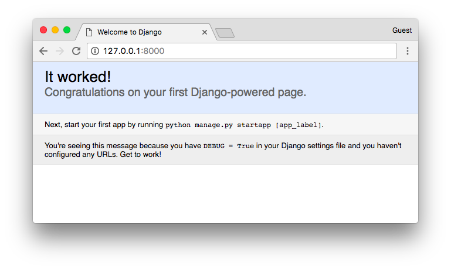
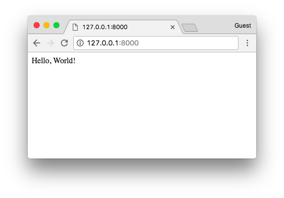

# Django入门指南-第2章：创建项目


### 启动一个新项目

执行下面的命令来创建一个新的 Django 项目：

```bash
django-admin startproject myproject
```

命令行工具**django-admin**会在安装Django的时候一起自动安装好。

执行了上面的命令以后，系统会为Django项目生成基础文件夹结构。

现在，我们的**myproject**目录结构如下所示：

```
myproject/                  <-- 高级别的文件夹
 |-- myproject/             <-- Django项目文件夹
 |    |-- myproject/
 |    |    |-- __init__.py
 |    |    |-- settings.py
 |    |    |-- urls.py
 |    |    |-- wsgi.py
 |    +-- manage.py
 +-- venv/                  <-- 虚拟环境文件夹
```

我们最初的项目结构由五个文件组成：

* **manage.py**：使用**django-admin**命令行工具的快捷方式。它用于运行与我们项目相关的管理命令。我们将使用它来运行开发服务器，运行测试，创建迁移等等。
* **__init.py**：这个空文件告诉python这个文件夹是一个python包。
* **settings.py**：这个文件包含了所有的项目配置。将来我们会一直提到这个文件！
* **urls.py**：这个文件负责映射我们项目中的路由和路径。例如，如果你想在访问URL `/ about/` 时显示某些内容，则必须先在这里做映射关系。
* **wsgi.py**：该文件是用于部署的简单网关接口。你可以暂且先不用关心她的内容，就先让他在那里就好了。

django自带了一个简单的网络服务器。在开发过程中非常方便，所以我们无需安装任何其他软件即可在本地运行项目。我们可以通过执行命令来测试一下它：

```bash
python manage.py runserver
```

现在，你可以忽略终端中出现的迁移错误;我们将在稍后讨论。

现在在Web浏览器中打开URL：**[http://127.0.0.1:8000](http://127.0.0.1:8000)**，你应该看到下面的页面：



使用组合键 `Control + C`来终止开发服务器。

----


### Django 应用

在Django的哲学中，我们有两个重要的概念：

* **app**：是一个可以做完成某件事情的Web应用程序。一个应用程序通常由一组**models(数据库表)**，**views(视图)**，**templates(模板)**，**tests(测试)** 组成。
* **project**：是配置和应用程序的集合。一个项目可以由多个应用程序或一个应用程序组成。

请注意，如果没有一个**project**，你就无法运行Django应用程序。像博客这样的简单网站可以完全在单个应用程序中编写，例如可以将其命名为**blog**或**weblog**。


这是组织源代码的一种方式。现在刚开始，判断什么是或不是应用程序这些还不太重要。包括如何组织代码等。现在不用担心那些问题！首先让我们对Django的API和基础知识进行梳理一遍。

好的！那么，为了方便说明，我们来创建一个简单的*网络论坛*或*讨论区*。要创建我们的第一个应用程序，请跳转到**manage.py**文件所在的目录并执行以下命令：

```bash
django-admin startapp boards
```

注意!我们这次使用的命令是**startapp**。

通过这条指令，系统会给我们创建以下目录结构：

```
myproject/
 |-- myproject/
 |    |-- boards/                <-- 我们新的Django应用（app）!
 |    |    |-- migrations/
 |    |    |    +-- __init__.py
 |    |    |-- __init__.py
 |    |    |-- admin.py
 |    |    |-- apps.py
 |    |    |-- models.py
 |    |    |-- tests.py
 |    |    +-- views.py
 |    |-- myproject/
 |    |    |-- __init__.py
 |    |    |-- settings.py
 |    |    |-- urls.py
 |    |    |-- wsgi.py
 |    +-- manage.py
 +-- venv/
```

下面，我们来探讨每个文件的作用：

* **migrations/**：在这个文件夹里，Django会存储一些文件以跟踪你在**models.py**文件中创建的变更，用来保持数据库和**models.py**的同步。
* **admin.py**：这个文件为一个django内置的应用程序**Django Admin**的配置文件。
* **apps.py**：这是应用程序本身的配置文件。
* **models.py**：这里是我们定义Web应用程序数据实例的地方。models会由Django自动转换为数据库表。
* **tests.py**：这个文件用来写当前应用程序的单元测试。
* **views.py**：这是我们处理Web应用程序请求(request)/响应(resopnse)周期的文件。

现在我们创建了我们的第一个应用程序，让我们来配置一下项目以便启用这个应用程序。

要做到这一点，打开**settings.py**并尝试找到`INSTALLED_APPS`变量：

**settings.py**

```python
INSTALLED_APPS = [
    'django.contrib.admin',
    'django.contrib.auth',
    'django.contrib.contenttypes',
    'django.contrib.sessions',
    'django.contrib.messages',
    'django.contrib.staticfiles',
]
```

如你所见，Django默认已经安装了6个内置应用程序。它们提供大多数Web应用程序所需的常用功能，如身份验证，会话，静态文件管理（图像，JavaScript，CSS等）等。

我们将会在本系列教程中探索这些应用程序。但现在，先不管它们，只需将我们的应用程序**boards**添加到`INSTALLED_APPS`列表即可：

```python
INSTALLED_APPS = [
    'django.contrib.admin',
    'django.contrib.auth',
    'django.contrib.contenttypes',
    'django.contrib.sessions',
    'django.contrib.messages',
    'django.contrib.staticfiles',

    'boards',  # 译者注：建议和作者一样空一行来区别内置app和自定义的app
]
```

使用前面漫画正方形和圆圈的比喻，黄色的圆圈就是我们的**boards**应用程序，**django.contrib.admin, django.contrib.auth**等就是红色的圆圈。

----

### Hello, World!

现在来写我们的第一个**视图(view)**。我们将在下一篇教程中详细探讨它。但现在，让我们试试看看如何用Django创建一个新页面。

打开**boards**应用程序中的**views.py**文件，并添加以下代码：

**views.py**

```python
from django.http import HttpResponse

def home(request):
    return HttpResponse('Hello, World!')

```

视图是接收`httprequest`对象并返回一个`httpresponse`对象的Python函数。接收 *request* 作为参数并返回 *response* 作为结果。这个流程你必须记住！

我们在这里定义了一个简单的视图，命名为**home**，它只是简单地返回一个信息，一个字符串**hello，world!**。

现在我们必须告诉Django什么时候会调用这个view。这需要在urls.py文件中完成：

**urls.py**

```python
from django.conf.urls import url
from django.contrib import admin

from boards import views

urlpatterns = [
    url(r'^$', views.home, name='home'),
    url(r'^admin/', admin.site.urls),
]
```

如果你将上面的代码片段与你的**urls.py**文件进行比较，你会注意到我添加了以下新代码：`url（r'^ $'，views.home，name ='home'）`并通过`from boards import views`从我们的应用程序**boards**中导入了**views**模块。

和我之前提到的一样，我们将在稍后详细探讨这些概念。

现在，Django使用**正则表达式**来匹配请求的URL。对于我们的**home**视图，我使用`^$` 正则，它将匹配一个空路径，也就是主页（这个URL：[http://127.0.0.1:8000](http://127.0.0.1:8000) ）。如果我想匹配的URL是 **[http://127.0.0.1:8000/homepage/](http://127.0.0.1:8000/homepage/)** ，那么我的URL正则表达式就会是：`url(r'^homepage/$', views.home, name='home')`。

我们来看看会发生什么：

```bash
python manage.py runserver
```

在一个Web浏览器中，打开 **[http://127.0.0.1:8000](http://127.0.0.1:8000)** 这个链接：



就是这样！你刚刚成功创建了你的第一个视图。

### 总结

这是本系列教程的第一部分。在本教程中，我们学习了如何安装最新的Python版本以及如何设置开发环境。我们还介绍了虚拟环境，开始了我们的第一个django项目，并已经创建了我们的初始应用程序。

我希望你会喜欢第一部分！第二部分将于2017年9月11日下周发布。它将涉及模型，视图，模板和URLs。我们将一起探索Django所有的基础知识！如果您希望在第二部分发布时收到通知，可以订阅我们的[邮件列表](http://eepurl.com/b0gR51)。

为了让我们能够保持学习过程中页面同步，我在Github上提供了源代码。这个项目的当前状态可以在**release tag v0.1-lw**下找到。下面是直达链接：

[https://github.com/sibtc/django-beginners-guide/tree/v0.1-lw](https://github.com/sibtc/django-beginners-guide/tree/v0.1-lw)