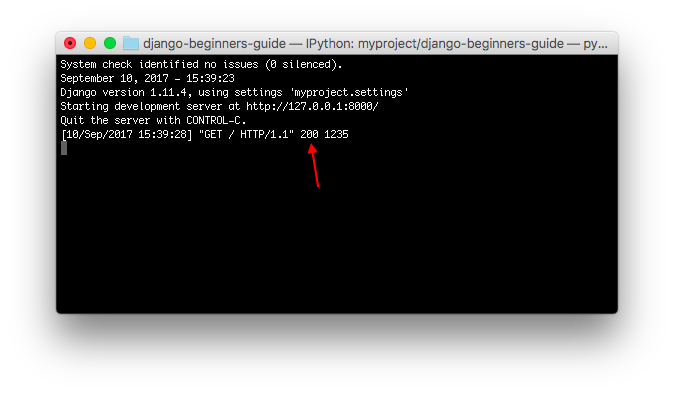

# Django入门指南-第7章：第一个测试用例

### 测试主页


测试将是一个反复出现的主题，我们将在整个教程系列中一起探讨不同的概念和策略。

我们来开始写第一个测试。现在，我们将在**boards**应用程序内的**tests.py**文件中操作

**boards/tests.py**

```ptyhon
from django.core.urlresolvers import reverse
from django.test import TestCase

class HomeTests(TestCase):
    def test_home_view_status_code(self):
        url = reverse('home')
        response = self.client.get(url)
        self.assertEquals(response.status_code, 200)
```

这是一个非常简单但非常有用的测试用例，我们测试的是请求该URL后返回的响应状态码。状态码200意味着成功。

请求一下主页后，我们可以在控制台中看到响应的状态代码：



如果出现未捕获的异常，语法错误或其他任何情况，Django会返回状态代码500，这意味着是**内部服务器错误**。现在，想象我们的应用程序有100个视图函数。如果我们为所有视图编写这个简单的测试，只需一个命令，我们就能够测试所有视图是否返回成功代码，因此用户在任何地方都看不到任何错误消息。如果没有自动化测试，我们需要逐一检查每个页面是否有错误。

执行Django的测试套件：

```sh
python manage.py test
```

```sh
Creating test database for alias 'default'...
System check identified no issues (0 silenced).
.
----------------------------------------------------------------------
Ran 1 test in 0.041s

OK
Destroying test database for alias 'default'...
```

现在我们可以测试Django是否在请求的URL的时候返回了正确的视图函数。这也是一个有用的测试，因为随着开发的进展，您会发现urls.py模块可能变得非常庞大而复杂。URL conf 全部是关于解析正则表达式的。有些情况下有一个非常宽容的URL（译注：本来不应该匹配的，却因为正则表达式写的过于宽泛而错误的匹配了），所以Django最终可能返回错误的视图函数。

我们可以这样做：

**boards/tests.py**

```python
from django.core.urlresolvers import reverse
from django.urls import resolve
from django.test import TestCase
from .views import home

class HomeTests(TestCase):
    def test_home_view_status_code(self):
        url = reverse('home')
        response = self.client.get(url)
        self.assertEquals(response.status_code, 200)

    def test_home_url_resolves_home_view(self):
        view = resolve('/')
        self.assertEquals(view.func, home)
```

在第二个测试中，我们使用了`resolve`函数。Django使用它来将浏览器发起请求的URL与urls.py模块中列出的URL进行匹配。该测试用于确定URL `/` 返回 home 视图。

再次测试：

```sh
python manage.py test
```

```sh
```sh
Creating test database for alias 'default'...
System check identified no issues (0 silenced).
..
----------------------------------------------------------------------
Ran 2 tests in 0.027s

OK
Destroying test database for alias 'default'...
```

要查看有关测试执行时更详细的信息，可将**verbosity**的级别设置得更高一点：


```sh
python manage.py test --verbosity=2
```

```sh
Creating test database for alias 'default' ('file:memorydb_default?mode=memory&cache=shared')...
Operations to perform:
  Synchronize unmigrated apps: messages, staticfiles
  Apply all migrations: admin, auth, boards, contenttypes, sessions
Synchronizing apps without migrations:
  Creating tables...
    Running deferred SQL...
Running migrations:
  Applying contenttypes.0001_initial... OK
  Applying auth.0001_initial... OK
  Applying admin.0001_initial... OK
  Applying admin.0002_logentry_remove_auto_add... OK
  Applying contenttypes.0002_remove_content_type_name... OK
  Applying auth.0002_alter_permission_name_max_length... OK
  Applying auth.0003_alter_user_email_max_length... OK
  Applying auth.0004_alter_user_username_opts... OK
  Applying auth.0005_alter_user_last_login_null... OK
  Applying auth.0006_require_contenttypes_0002... OK
  Applying auth.0007_alter_validators_add_error_messages... OK
  Applying auth.0008_alter_user_username_max_length... OK
  Applying boards.0001_initial... OK
  Applying sessions.0001_initial... OK
System check identified no issues (0 silenced).
test_home_url_resolves_home_view (boards.tests.HomeTests) ... ok
test_home_view_status_code (boards.tests.HomeTests) ... ok

----------------------------------------------------------------------
Ran 2 tests in 0.017s

OK
Destroying test database for alias 'default' ('file:memorydb_default?mode=memory&cache=shared')...
```
Verbosity决定了将要打印到控制台的通知和调试信息量; 0是无输出，1是正常输出，2是详细输出。
